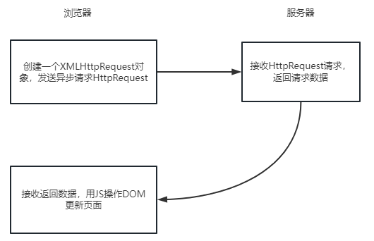

## ajax原理
AJAX全称（Async Javascript and XML）, 是一种创建交互式网页应用的网页开发技术，可以在不在重新加载整个网页的情况下，与服务器交换数据，并且更新部分网页

> 原理：通过XmlHttpRequest对象来向服务器发异步请求，从服务器获取数据，然后用JavaScript来操作Dom而更新页面

例子:
领导想找小A汇报工作，委托了自己的小秘去联系小A，自己就做自己的事情，直到小秘告诉领导，小A已经到了。领导就停止工作，进行和小A的汇报工作

在例子当中，领导就是浏览器、小秘就是XMLHttpRequest对象、小A就是响应的数据。在响应数据到来之前，浏览器可以继续做其他的事情。

### 实现过程
- 创建Ajax的核心对象XMLHttpRequest对象
- 通过XMLHttpRequest对象的open()方法与