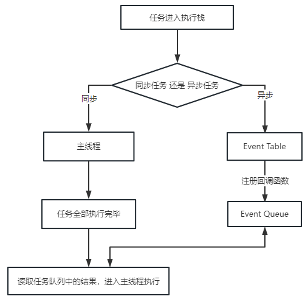
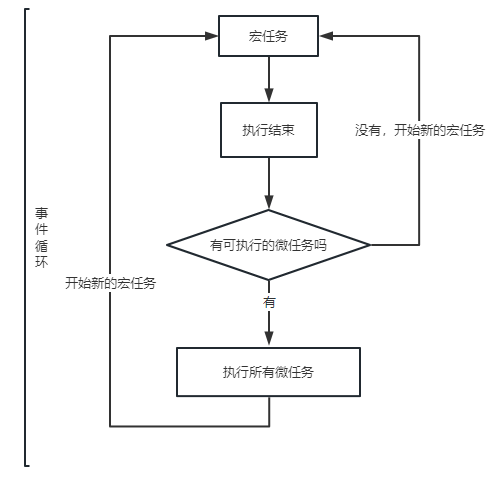

## 事件循环

> JS是单线程语言，这意味着同一个时间内只能做一件事，这意味着如果不进行处理，就会进行阻塞。而JS中使用**事件循环**来使得程序实现单线程非阻塞方法

在JS当中，所有的任务可以分成
1. 同步任务: 立即执行的任务，同步任务一般会直接进入到主线程中执行
2. 异步任务：异步执行的任务，比如ajax网络请求,setTimeout定时函数等



同步任务进入主线程，异步任务进入任务队列，主线程内的任务执行完毕为空，会去任务队列读取对应的任务，推入主线程执行。
这事情一直不断重复就是事件循环了


### 宏任务与微任务

微任务： 异步执行，在主函数执行结束之后，宏任务结束之前
1. Promise.then
2. MutationObserver
3. Object.observe(已废弃，Proxy对象替代)
4. process.nextTick(Node.js)

宏任务： 执行时间间隔是不能精确控制的
1. script（外层同步代码）
2. setTimeout/setInterval
3. UI rendering/UI事件
4. postMessage、MessageChannel
5. setImmediate、I/O（Node.js）



执行机制是：
1. 执行一个宏任务，如果遇到微任务就把它放到微任务的事件队列中
2. 当前宏任务执行完成后，会查看微任务的事件队列，然后将里面的所有微任务都依次执行完

```js
console.log(1)
setTimeout(() => {
    console.log(2)
},0)
new Promise((resolve, reject)=>{
 console.log('new Promise')
 resolve()
}).then(()=>{
 console.log('then')
})
console.log(3)

/**
 * console.log(1)直接打印
 * setTimeout新的宏任务，放宏任务队列
 * 
 * new Promise console.log('new Promise')直接打印
 * .then微任务，放微任务队列
 * console.log（3）直接执行
 * -------------------------本轮宏任务执行完毕，检查微任务队列
 * .then执行，console.log('then')
 * -------------------------微任务队列结束，再执行新的宏任务
 * setTimeout console.log('2')
 */
```

### async 和 await
async是异步的意思，await是用来等待这个异步方法执行

- async
  async函数返回一个promise对象，所以下面两个方法是等效的
```js
function f(){
    return Promise.resolve('TEST')
}

async function asyncFn(){
    return 'TEST'
}
```
- await
  await命令后面是一个Promise对象，返回该对象的结果，如果不是Promise对象，就直接返回对应的值
  ```js
  async function f(){
    return await 123  // 等同于return 123
  }
  f().then(v => console.log(v)) // 123
  ```
  不管await后面跟着什么，await都会阻塞后面的代码
  ```js
  async function fn1(){
    console.log(1)
    await fn2()
    console.log(2) // 阻塞
  }

  async function fn2(){
    console.log('fn2')
  }

  fn1()
  console.log(3)
  // await会阻塞下面的代码(即加入微任务队列)，
  /**
   *    1.先执行async await外面的同步代码，
        2.同步代码执行完，再回到async函数中，
        3.再执行之前的阻塞的代码
   */
  // 1 => fn2 => 3 => 2
  ```


- 测试一下
```js
async function async1() {
    console.log('async1 start')  // 2
    await async2()
    console.log('async1 end')  // 6
}

async function async2() {
    console.log('async2') // 3
}

console.log('script start')  // 1

setTimeout(function () {
    console.log('settimeout')  // 8
})

async1()

new Promise(function (resolve) {
    console.log('promise1')    // 4
    resolve()
}).then(function () {
    console.log('promise2')  // 7
})

console.log('script end')   // 5
```
1. 执行同步任务    //  script start
2. 遇到定时器，是宏任务，放下个周期执行
3. async1()         // async1 start
    - 3.1 遇到await async2,阻塞其他的进程   // async2
    - 3.2 执行完await async2 就会跳出去执行同步代码
4. new Promise  // promise1
    - 4.1 then属于微任务，放到微任务列表当中
5. 执行同步任务  //  script end
- ---------------------------------同步代码执行完成,开始执行微任务
1. 执行await下面得代码，打印async1 end
2. 执行微任务 //  then. promise2
- -----------------本次宏任务完成，执行下一次宏任务
1. 新得宏任务执行setTimeout  //  setTimeout

