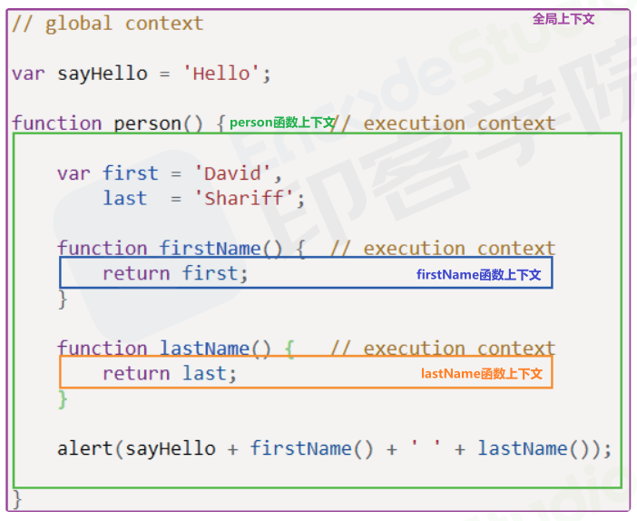

## 执行上下文

### 概念

#### 顺序执行
- 写过js的同学们都会有直观的印象，那就是顺序执行

```js
var foo = function () {
 console.log('foo1');
}
foo(); // foo1

var foo = function () {
 console.log('foo2');
}
foo(); // foo2

```

```js
function foo() {
 console.log('foo1');
}
foo(); // foo2

function foo() {
 console.log('foo2');
}
foo(); // foo2
// -----------------------> 这次打印为两个foo2
```

这是因为JS引擎并不是一行行的分析执行的。而是一段段的分析执行。当执行一段代码时，会进行 **准备工作**

这里的**准备工作**，就是 **执行上下文（execution context）**

在了解准备工作之前，我们要先了解一个概念就是 **可执行代码**

---

#### 可执行代码
执行上下文分为3种类型
1. 全局执行上下文： 只有一个，全局对象，浏览器中就是window
2. 函数执行上下文： 无数个，当函数被调用时就会被创建，每次调用都会创建一个新的
3. Eval函数执行上下文：指运行在eval函数中的代码，很少而且不建议使用



- 可以有任意多个函数上下文，每次调用函数创建一个新的上下文，会创建一个私有作用域，函数内部声明的任何变量，都不能在当前函数作用域外部直接访问

---

### 生命周期
执行上下文的生命周期包括三个阶段： 创建阶段 - 执行阶段 - 回收阶段

#### 1.创建阶段
- 创建阶段就是函数被调用，但未执行任何内部代码之前

创建阶段
伪代码模拟

```
ExecutionContext = {
    ThisBinding = <this value>, // 确定this
    LexicalEnvironment: {...} // 词法环境
    VariableEnvironment： {...} // 变量环境
}
```

1. 确定this的值,也被称为 This Binding
   - this的值定义时不能被确认，只有在执行的时候才能被确认
2. 词法环境(LexicalEnvironment)组件被创建
   - 全局环境：是一个没有外部环境的词法环境，其外部环境为null，有一个全局对象，this 的值指向这个全局对象
   - 函数环境：用户在函数中定义的变量被存储在环境记录中，包含了arguments对象，外部环境的引用可以是全局环境，也可以是包含内部函数的外部函数环境
   - 伪代码模拟
   ```
   GlobalExectionContext = {
        LexicalEnvironment:{  // 词法作用
            EnvironmentRecord:{//  环境记录
                Type: "Object",  //  全局对象类型
                outer: <null> // 对外部环境的引用
            }
        }
   }

   FunctionExectionContext = {
        LexicalEnvironment:{   // 词法作用
            EnvironmentRecord:{ //  环境记录
                Type: "Declarative,  //  全局对象类型
                outer: <Global or outer function environment reference>  - 标记符绑定
            }
        }
   }

   ```
3. 变量环境(VariableEnvironment)组件被创建
   - 变量环境也是一个词法环境，因为这时候已经具有上面定义的词法环境的所有属性
   - 在es6中,词法环境和变量环境的区别是: 词法存储函数声明和变量（let和const）绑定，而变量仅用于存储变量（var）绑定
   - 举个例子：
    ```js
    let a = 20
    const b = 30
    var c

    function add(e,f){
        var g = 20
        return e  + f + g
    }

    c= add(a,b)
    ```

    ```
    // 全局执行上下文
    GlobalExectionContext = {
        ThisBinding: <Global Object>,
        LexicalEnvironment:{ // 词法环境(let const func)
            EnvironmentRecord：{
                Type: "Object",
                a:<uninitialized>,
                b:<uninitialized>,
                add:<func>
            },
            outer:<null>
        },
        VariableEnvironment:{ // 变量环境(var)
            EnvironmentRecord：{
                Type:"Object",
                c: undefined
            }
            outer:<null>
        }
    }

    // 函数执行上下文
    FunctionExectionContext = {   
        ThisBinding: <Global Object>,
        LexicalEnvironment: {
            EnvironmentRecord:{
                Type:"Declarative",
                Arguments:{0: a, 1: b, length: 2}
            },
            outer: <GlobalLexicalEnvironment>
        },

        VariableEnvironment:{
            EnvironmentRecord:{
                Type:"Declarative",
                g: undefined
            },
            outer:<GlobalLexicalEnvironment>
        }
    }

    ```

#### 2.执行阶段
在执行阶段，执行变量赋值、代码执行。如果JS引擎在源代码中声明得实际位置找不到变量得值，就会被赋值为undefined

#### 3.回收阶段
执行上文出栈等待虚拟机回收执行上下文


---
#### 执行上下文栈（LIFO）
- 后进先出结构
JS为了管理 执行上下文 ，创建了 **执行上下文栈（Execution context stack， ECS）**

为了更清晰明了，我们定义数组 去模拟 **执行上下文栈** 的行为

```js
ECStack = []  // 模拟执行上下文栈
```
---
##### 1. 全局代码
> JS开始执行代码，首先遇到就是全局代码。所以在初始化的时候会向 执行上下文栈 压入一个全局执行上下文，我们用 globalContext

- 初始化时，会把全局执行上下文压入 执行上下文栈中，栈是先进后出，所以只有当整个应用程序结束时，ECStack才会被清空。

```js
ECStack = [
    globalContext
]
```

###### 1-1 示例分析1
> 当执行一个函数时,会创建一个执行上下文，并把它压入到执行上下文栈中，当函数执行完成后，会将这个函数的执行上下文从 栈 中弹出

```js
function f3(){
    console.log('f3')
}

function f2(){
   f3()
}

function f1(){
   f2()
}

f1()
```

-  ECStack.push(< f1> functionContext)
-  ECStack.push(< f2> functionContext)
-  ECStack.push(< f3> functionContext)
-  // ---------执行f3，输出'f3'
-  ECStack.pop()  // f3弹出
-  ECStack.pop()  // f2弹出
-  ECStack.pop()  // f1弹出

###### 1-2 示例分析2
- 上章这个示例，结果都为local scope 那么他们的执行栈有啥不一样呢
```js
// case 1
var scope = "global scope";
function checkScope(){
    var scope = "local scope"
    function f(){
        return scope
    }
    return f()
}
checkScope()
 
// case 2
var scope = "global scope";
function checkScope(){
    var scope = "local scope"
    function f(){
        return scope
    }
    return f
}
checkScope()()
```

- case1
> - ECStack.push(< checkScope> functionContext)
> - ECStack.push(< f> functionContext)
> - 执行完成 f()
> - ECStack.pop()  // f弹出
> - ECStack.pop()  // checkScope弹出


- case2
> - ECStack.push(< checkScope> functionContext)
> - ECStack.pop()  // checkScope弹出
> - ECStack.push(< f> functionContext)
> - ECStack.pop()  // f弹出

这就是我们的执行上下文栈
---