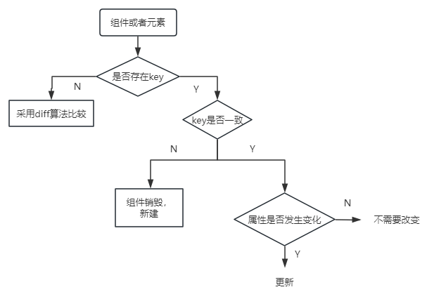
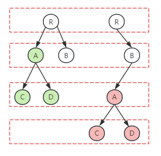
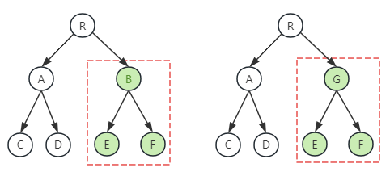
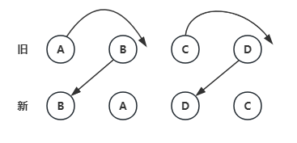
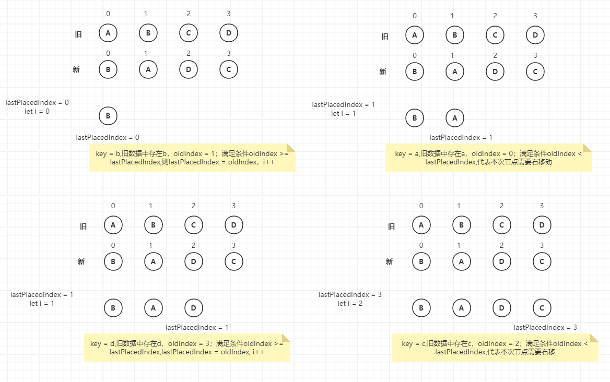

## diff
Key唯一值，是diff算法的关键，他的作用在于判断元素是新创建的还是被移动的元素。从而减少不必要元素的渲染。diff算法就是高效的通过对比新旧vdom找到真正dom变化之处

### key
- key应该是唯一的
- key最好不要使用随机值
- 使用index作为key，对性能没有优化

### diff算法
diff算法主要遵循三个层级的策略：
- tree层级
- component层级
- element层级
  
#### tree层级
DOM节点夸层级的操作不做优化，只会对相同层级的节点进行比较。只有删除、创建，没有移动

- 第一层：都是R，无变化
- 第二层：没了A，所以需要整个删除A（包括子元素CD）
- 第三层：新增了A，所以需要新增A节点
- 第四层：新增BC，所以需要新增BC节点

#### component层级
如果同一个类的组件，会继续往下diff运算，如果不是一个类的组件，就直接删除这个组件下所有的子节点，创建新的节点

当componentD 换成 componentG 后，即使两者结构非常类似，D也会删除再重新创建整个componentG

#### element层级
同一层级的节点们，每个节点都有对应唯一的key值做标识。这层级提供了3种节点操作，分别为 插入(INSERT_MARKUP)、移动（MOVE_EXISTING）、删除（REMOVE_NODE）、

### diff
我们需要标记最后一个可复用的节点在oldFiber中的位置索引（用变量lastPlacedIndex表示）
如果oldIndex < lastPlacedIndex，代表本次更新该节点需要向右移动；
如果oldIndex >= lastPlacedIndex，则lastPlacedIndex = oldIndex

| index | 节点 | oldIndex | lastPlacedIndex | 操作 | 
| --- | --- | --- | --- | --- | 
| 0 | B | 1 | 0 | 如果oldIndex >= lastPlacedIndex，则lastPlacedIndex = oldIndex  | 
| 1 | A | 0 | 1 | oldIndex < lastPlacedIndex，代表本次更新该节点需要向右移动 | 
| 2 | D | 3 | 1 | 如果oldIndex >= lastPlacedIndex，则lastPlacedIndex = oldIndex | 
| 3 | C | 2 | 3 | oldIndex < lastPlacedIndex，代表本次更新该节点需要向右移动 | 

- 得到AC节点需要向右移动

### diff算法的源码