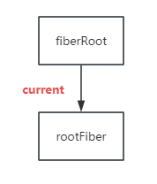
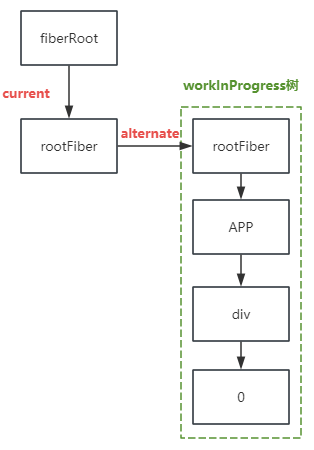
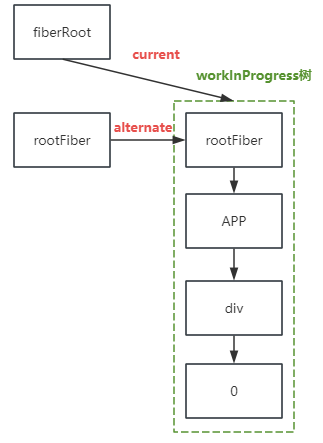
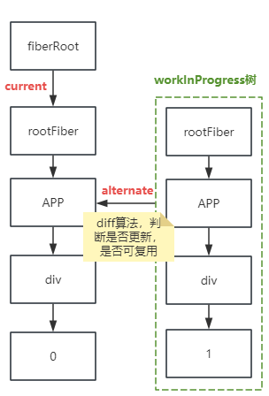
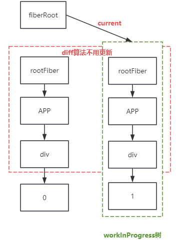

## Fiber架构

在React 15及之前的版本中，React使用了一种称为堆栈调和递归（stack reconciliation）的算法来处理虚拟DOM的更新

### 前言
JavaScript引擎和GUI页面渲染引擎两个线程是互斥的，当其中一个线程执行时，另一个线程只能挂起等待，如果JavaScript线程长时间地占用了主线程，那么渲染层面的更新就不得不长时间地等待，界面长时间不更新，导致页面响应度变差，用户可能感觉到卡顿。

这就是React15的Stack Reconciler所面临的问题，当react在渲染组件时，从开始到渲染完成整个过程是一气呵成，无法中断

- 网页卡顿的主要问题：
- CPU瓶颈
- IO的瓶颈

#### 解决CPU瓶颈
> 掉帧：当下主流浏览器的刷新频率为60HZ（1000ms/60HZ），即每16.6ms浏览器刷新一次。在GUI渲染和JS执行互斥，如果一帧内js脚本执行占用过长时间(超过16.6ms)，那么就没有时间去执行渲染进程，就是所谓的“掉帧”

- 因此，要解决CPU瓶颈，就是需要再每一帧的时间里，限定一些时间给JS线程，然后让浏览器有剩余的时间去执行渲染进程。其中react一开始预留的初始时间为5ms。当预留时间不够时，React会将线程控制权交给浏览器让他继续渲染UI，React则在下一帧时间到来继续被中断的工作

- CPU 瓶颈关键是要实现时间切片，时间切片的关键是将同步更新变为可中断的异步更新

> 时间切片：这种将长任务拆分到每一帧中去执行每一段微小任务的操作被称为时间切片（time slice）

#### 解决IO瓶颈
IO的瓶颈主要来源于网络延迟，大多数时候开发者是无法解决的。在无法解决的情况下减少网络延迟对用户的感知，React实现了Suspense功能及配套的hook-useDeferredValue。这个特征同样需要将 同步更新 变成 可中断的异步更新

### 介绍
React Fiber是Facebook花费2年时间对React核心算法的一次重新实现，发布于react 16版本上。

- 在react中，主要做了以下操作
- 为每个任务增加了优先级，优先级高的任务可以中断低优先级任务，然后再**重新**执行优先级低的任务
- 增加了异步任务， 调用requestIdleCallback api，浏览器空闲的时候执行
- dom diff树变成链表，一个dom对应两个fiber（一个链表），对应两个队列，这都是为找到被中断的任务，重新执行


- 在架构层面，Fiber是对React核心算法（即调和过程）的重写
- 在编程层面，Fiber是React内部所定义的一种数据结构，它是Fiber树结构的节点单位，也就是React 16新架构下的虚拟Dom

一个fiber就是一个js对象，React Fiber可以理解为一个执行单元(work unit) ，也可以说是一种新的数据结构。包含元素信息、元素更新操作队列、类型、其数据结构如下
```jsx
type Fiber = {
    /** Instance 静态数据结构属性 */
    tag:WorkTag, // Fiber组件类型Function/Class
    key:null| string, // key唯一值 diff时需要
    elementType:any, //
    type:any, // 对于FunctionComponent指函数本身，对于ClassComponent指class，对HostComponent指Dom节点的tagName
    stateNode: any, //Fiber 对应的真实DOM节点

    /** 链接Fiber节点形成Fiber树所需属性 */
    return: Fiber | null, // 指向父级Fiber节点
    child:Fiber | null, // 指向子级Fiber节点
    sibling: Fiber | null, // 指向兄弟Fiber节点
    index: number, // 下标
    ref: null | (((handle: mixed) => void) & { _stringRef: ?string }) | RefObject,
    refCleanup = null;

    /** Fiber 动态工作单元，保存本次更新相关信息**/ 
    pendingProps: any, //当前组件属性
    memoizedProps: any, // 指向最近一次使用props
    updateQueue: UpdateQueue<any> | null, // 更新队列
    memoizedState: any, // 组件状态
    dependencies: any,// 依赖组件数据
    // 运行模式：1.并发模式(concurrent) 2.遗留模式（legacy）
    mode: TypeOfMode, 
    // 在并发模式下，React Fiber 会采取一系列优化策略，使组件的更新能够在多线程环境中异步地执行，从而提高应用的性能和用户体验。
    // 而在遗留模式下，React Fiber 会采用与 React 16 及之前版本相同的同步更新方式，即组件更新会阻塞浏览器主线程的运行直到更新完成后才能继续其他操作。
    firstContextDependency: ContextDependency<mixed> | null, // 列表，存放fiber依赖的context

    /** Effect */
    effectTag: SideEffectTag,
    nextEffect: Fiber | null,
    firstEffect: Fiber | null,
    lastEffect: Fiber | null,
    expirationTime: ExpirationTime,// 代表任务在未来某一个时间点应该被完成，之后版本改名为 lanes
    childExpirationTime: ExpirationTime,
    alternate: Fiber | null, // 指向该fiber在另一次更新时对应的fiber
}
// 在V16版中 Reconciler是基于 Fiber 节点实现的，被称为 Fiber Reconciler，支持可中断异步更新，任务支持时间切片
```

---
> React Fiber 通过分片（slicing）和优先级调度（priority scheduling）来实现高效组件更新和异步渲染
### 核心特点
1. 增量渲染：React Fiber将更新任务拆分成多个小任务单元（称为“fiber”），并使用优先级调度器来处理这些任务。这种增量渲染的方式使得React在更新时可以更灵活地控制和切换任务，提高应用的响应性
2. 可中断恢复：与之前的堆栈调和递归算法不同，Fiber架构允许在渲染过程中进行中断和恢复。这意味着React可以在渲染过程中暂停某些任务，以便处理更高优先级的任务，从而优化用户体验
3. 优先级调度：Fiber架构引入了优先级的概念，允许开发者为不同的更新任务设置不同的优先级。例如，键盘输入和点击事件等用户交互通常具有更高的优先级，而网络请求等后台任务则可能具有较低的优先级
4. 并发模式：在并发模式下，React可以暂停高消耗非紧急的组件的渲染，并专注于更加紧迫的任务。这有助于确保UI渲染的流畅性，避免白屏或卡顿等现象
---

### fiber工作原理

1. 构建Fiber树
    > React Fiber会创建一颗Fiber树，用于表示React组件树的结构和状态。Fiber树是一个轻量级的树形结构，与React组件树一一对应。React Fiber采用链表结构对树进行行分片拆分，实现递增渲染的效果

2. 确定调度优先级
    > Fiber树构建完成后，React Fiber会根据组件的更新状态和优先级，确定优先更新的组件，即"调度更新"。

3. 执行调度更新
   > 确定更新的组件后，React Fiber会将这些组件标记为 脏"dirty",并将他们放入更新队列中，等待处理。在Fiber中并不是立即执行更新操作，而是等待时间片到来时才开始执行，让React fiber执行更新时具有更高的优先级，提高应用的响应性和性能
   
4. 中断和恢复
   > 在执行更新中，如果需要中断当前任务，Fiber会根据当前优先级、执行时间等因素，中断当前任务，并将现场保存在堆栈中，当下次处理到该任务的时候，React Fiber 可以通过恢复堆栈中保存的现场信息，继续执行任务，从而实现中断和恢复的效果
   
5. 渲染和提交
   > React Fiber 会将更新结果渲染在页面上，并设置下一次更新的时间和优先级。React Fiber利用WebGL和canvas等原生绘制API，实现CPU加速


### 双缓存
> 在canvas绘制时，每一帧绘制前都会调用ctx.clearRect清理上一帧的画面，如果这时候计算量比较大，则清理完成到下一帧画面间隙太长，就会出现白屏现象。这时候可以在内存中进行绘制当前画面，绘制完成时直接替换，就不会出现白屏情况。这种在内存中构建并直接替换的技术叫**做双缓存技术**。 React使用“双缓存”来完成Fiber树的构建与替换——对应着DOM树的创建与更新


### Fiber树
在React中最多存在两颗Fiber树，当前显示Fiber树称为current Fiber树，内存中构建的是Fiber树，称为workInProgress Fiber树。这两棵树中的Fiber节点分别被称为Current Fiber和workInProgress Fiber。通过alternate属性链接，每次状态更新都会产生新的workInProgress Fiber树

```jsx
currentFiber.alternate === workInProgressFiber
workInProgressFiber.alternate === currentFiber
```

- Fiber树切换实例(双缓存)
React 通过使用current指针在不同Fiber树中 rootFiber 间切换完成current Fiber树指向
```jsx
// 用组件的mount/update两个周期来展示创建/更新流程
const App = () => {
    const [num, setNum] = useState(0);
    return <div onClick={() => setNum(num + 1)}>{num}</div>
}
ReactDOM.render(<App/>, document.getElementById('root'));
```
#### Mount时
- 首次执行时：执行方法ReactDOM.render,创建 fiberRoot 和 rootFiber 。 fiberRoot只有一个根结点。rootFiber可以有很多个

```jsx
fiberRoot.current = rootFiber
```
- render阶段: React会更具组件返回的jsx在内存中依次创建fiber节点并连接起来形成Fiber树，在内存中创建Fiber树（workInProgress树）过程中会复用current Fiber树中已有的Fiber节点的属性


- commit阶段：React会把workInProgress Fiber树替换掉current Fiber树。把fiberRoot的current指针指向workInProgress Fiber树


#### Update时
- 更新阶段，点击div节点，num从0变成1，这时候react会开始新的render并且创建一颗新的workInprogress Fiber树，这时候需要使用diff算法尝试复用current Fiber树。
- render阶段

- commit阶段


> Fiber工作核心是双缓存技术，其创建和更新的过程伴随着DOM的更新


### 源码

### 过程
1. Fiber把渲染更新过程拆分成多个子任务，每次只做一小部分，做完看是否还有剩余时间，如果有继续下一个任务，如果没有则挂起当前任务，把时间控制权交给主线程，等主线程不忙的时候再继续执行。即可中断与恢复，恢复后也可以复用之前的中间状态，并给不同的任务赋予不同的优先级，其中每个任务更新单元为React Element对应的Fiber节点
2. 实现的上述方式的是 requestIdleCallback 方法，window.requestIdleCallback()方法将在浏览器的空闲时段内调用的函数排队，使得开发者能在主事件循环上执行后台和低优先级工作
3. React中任务切割为多个步骤，分批完成。在完成一部分任务之后


### question
1. 有react fiber，为什么不需要 vue fiber呢
2. 之前递归遍历虚拟dom树被打断就得从头开始，为什么有了react fiber就能断点恢复呢