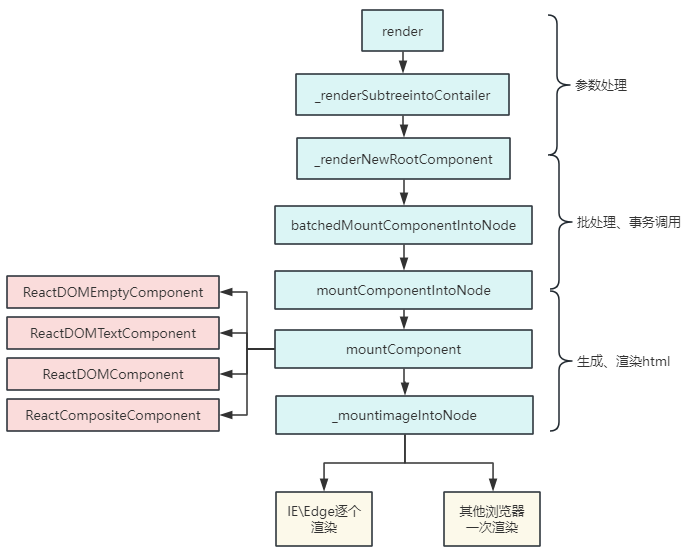

## JSX转换成dom
> JSX通过bebel转换成React.createElement

```jsx
<div>
    
    <Hello/>
</div>

// -------被bebel转化后
React.createElement(
    "div",
    null,
    React.createElement('img',{
        src:"avatar.png",
        className:"profile"
    })
    React.createElement(Hello,null)
)
```
> babel编译时，会判断JSX组件得首字母，当首字母为小写时，其认定为原生DOM标签，createElement的第一个变量被编译为字符串。当首字母为大写时，其认定为自定义组件，createElement第一个变量被编译为对象


最后都会通过RenderDOM.render(...)方法进行挂载
```jsx
ReactDOM.render(<App/>, document.getElementById('root'))
```

### creatElement源码
```jsx
// 传入标签类型type、标签属性props 及若干子元素children，作用是生成一个虚拟Dom对象
function createElement(type, config, ...children) {
    if (config) {
        delete config.__self;
        delete config.__source;
    }
    // ! key ref
    const props = {
        ...config,
        children: children.map(child =>
            typeof child === "object" ? child : createTextNode(child)
        )
    };
    return {
        type,
        props
    };
}
function createTextNode(text) {
    return {
        type: TEXT,
        props: {
            children: [],
            nodeValue: text
        }
    };
}
export default {
    createElement
};
```

> React.createElement作用是生成一个虚拟dom对象

### 过程
节点类型
- 原生标签节点： type为字符串，如 div、span
- 文本节点：type就没有，这里是TEXT
- 函数组件： type是函数名
- 类组件：type是类名

```jsx
// 虚拟dom会通过render渲染成真实的dom
ReactDOM.render(element,containerl,callback)
```

> 首次调用时，容器节点里的所有DOM元素都会被替换，后续的调用则会使用React的diff算法进行高效更新
> 如果提供了可选得回调函数callback，该回调将在组件被渲染或更新后执行

render源码如下
```jsx
function render(vnode, container){
    console.log('vnode',vnode) //虚拟dom对象
    const node = createNode(vnode,container)
    container.appendChild(node)
}

// 创建真实的dom节点
function createNode(vnode, parentNode){
    let node = null;
    const { type, props} = vnode;
    if(type === TEXT){
        node = document.createTextNode('')
    }else if(typeof type === 'string'){
        node = document.createElement(type)
    }else if(typeof type === 'function'){
        node = type.isReactComponent? updateClassComponent(vnode,parentNode):updateFunctionComponent(vnode,parentNode)
    }else{
        node = document.createDocumentFragment()
    }
    reconcileChildren(props.children,node)
    updateNode(node,props);
    return node
}

// 遍历下 子vnode,然后把子vnode 变成 真dom节点，然后插入父node中
function reconcileChildren(children,node){
    for(let i = 0; i<children.length; i++){
       let child = children[i]
       if(Array.isArray(child)){
            for(let j =0;j< child.length;j++){
               render(child[j],node)
            }
       }else{
            render(child,node)
       }
    }
}

function updateNode(node, nextVal){
    Object.keys(nextVal)
    .filter( k => k!=='children')
    .forEach(k => {
        if(k.slice(0,2) === 'on'){
            let eventName = k.slice(2).toLocaleLowerCase();
            node.addEventListener(eventName, nextVal[k]);
        }
        else{
            node[k] = nextVal[k];
        }
    })
}


// 返回真实的dom节点
// 执行函数
function updateFunctionComponent(vnode, parentNode) {
    const {type, props} = vnode;
    let vvnode = type(props);
    const node = createNode(vvnode, parentNode);
    return node;
}
// 返回真实的dom节点
// 先实例化，再执行render函数
function updateClassComponent(vnode, parentNode) {
    const {type, props} = vnode;
    let cmp = new type(props);
    const vvnode = cmp.render();
    const node = createNode(vvnode, parentNode);
    return node;
}

export default {
 render
};
```

### 总结
在react源码中，虚拟dom转化成真实dom整体流程如下：


##### 渲染流程
- 使用React.createElement或JSX编写React，实际上JSX代码都会被转换成React.createElement(...),Babel会帮我们完成这个转换过程
- createElement函数对key和ref等特殊的props进行处理，并获取defaultProps对默认props进行赋值，并且对传入的孩子节点进行处理，最终构造成一个虚拟Dom对象
- ReactDOM.render将生成好的虚拟DOM渲染到指定容器上，其中采用了批处理、事务等机制并且对特定浏览器进行性能优化，最终转换为真实的DOM


