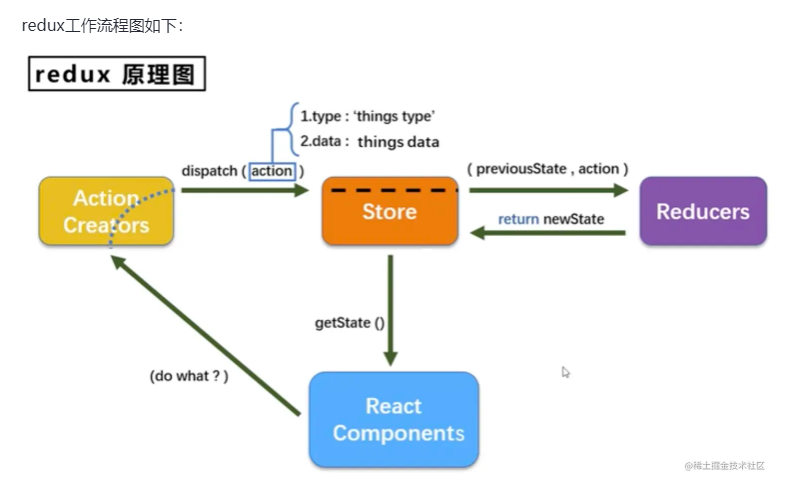

## Redux
> Redux用于数据状态管理，而react是一个视图层面的UI库，可以使用react-redux去做数据状态管理

react-redux将组件分成
1. 容器组件：存在逻辑处理
2. UI组件：只负责显示和交互、内部不处理逻辑，状态由外部控制

简诉过程
1.通过redux将整个应用状态存储到store中，组件可以派发dispatch行为action给store，其他组件通过订阅store中状态state来更新终身的试图

### 核心
react-redux有2大核心
1. Provider
2. connection

#### 1.Provider
在redux中存在一个store用于存储state，如果将这个store存放在顶层元素中，其他组件都被包裹在顶层元素之上
所有的组件都能受到redux的控制，都能获取到redux的数据
```jsx
<Provider store = {store}>
    <App />
<Provider>
```

#### 2.connection
connect 方法将store上的getState 和 dispatch 包装成组件的props
导入connect如下
```js
import {connect} from 'react-redux'
// 可传递两个参数 mapStateToProps、mapDispatchToProps
connect(mapStateToProps, mapDispatchToProps)(MyComponent)
```

##### （1）mapStateToProps
```js
// 把redux的数据映射到react中props
const mapStateToProps = (state) => {
    return {
        // prop : state.xxx | 将state的数据映射到props中
        foo: state.bar
    }
}
// 组件内部可以通过props获取到store中的数据
class Foo extends Component{
    constructor(props){
        super(props)
    }
    render(){
        return(
            <div>{this.props.foo}</div>
        )
    }
}
Foo = connect()(Foo)
export default Foo
```

##### (2)mapDispatchToProps
```js
// 将redux中的dispatch映射到组件内部的props中
const mapDispatchToProps = (dispatch) => { // 默认传递参数就是dispatch
    return {
        onClick:() => {
            dispatch({
                type:'increatment'
            })
        }
    }
}

class Foo extends Component {
    constructor(props){
        super(props);
    }
    render(){
        return(
            <button onClick = {this.props.onClick}> increase</button>
        )
    }
}
Foo = connect()(Foo);
export default Foo;
```

## 流程
