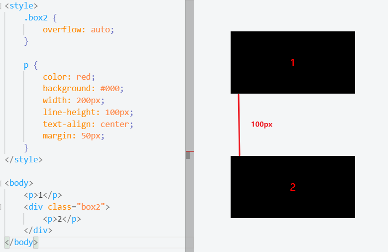
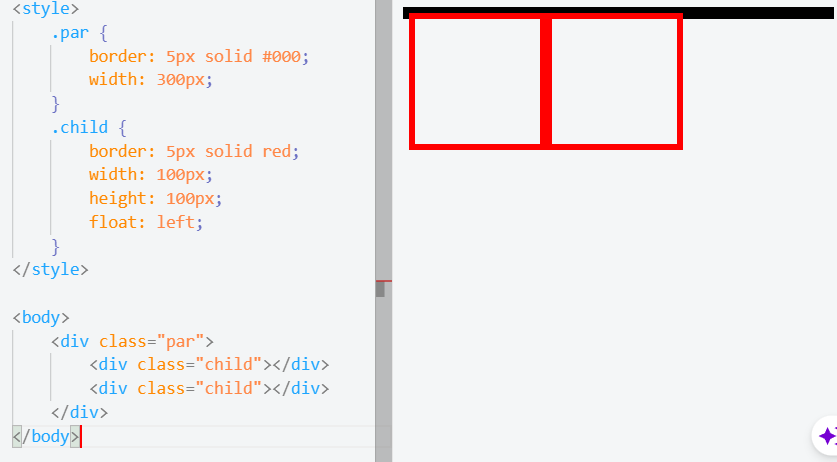
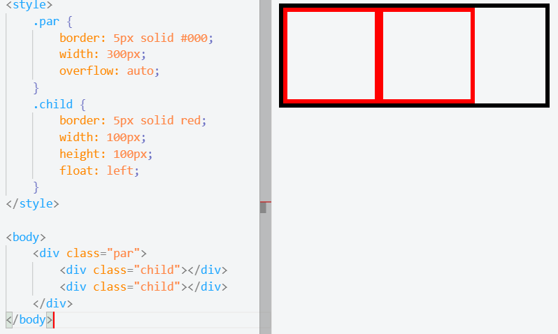
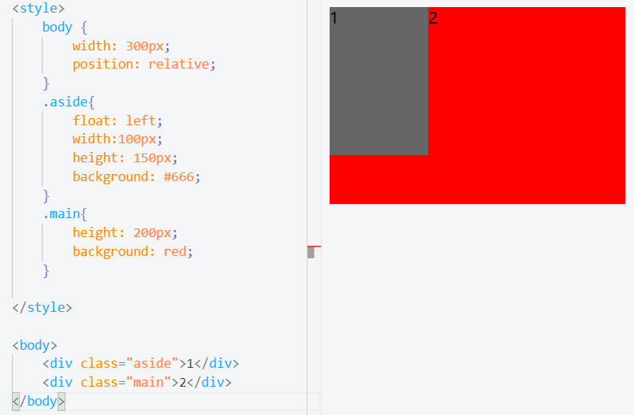
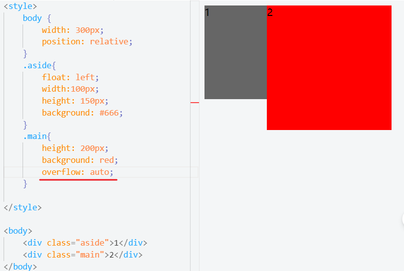

## BFC(Block Formatting Context)
### 定义
> BFC，块级格式化上下文，它是页面的一块渲染区域，有自己的渲染规则

- 规则
1. 内部盒子会在垂直方向上一个接着一个放置
2. 对于同一个BFC的两个相邻的盒子 margin 会发生重叠，与方向无关
3. 每个元素的左外边距与包含块的左边界接触（从左到右），即使浮动元素也是如此
4. BFC的区域不会与float的元素区域重叠
5. 计算BFC的高度时，浮动子元素也会参与计算
6. BFC就是页面一个隔离的独立容器，容器里的子元素不会影响到外面的元素

> BFC目的就是为了形成一个相对于外界完全独立的空间，让内部子元素不会影响到外部的元素

### 触发条件
1. 根元素
2. 浮动元素：float值为left、right
3. overflow值不为visible， 为auto、scroll、hidden
4. display的值inline-block、inltable-cell、table-caption、table、inline-table、flex、inline-flex、grid、inline-grid
5. position的值为 absolute 或 fixed

### 应用场景
####  防止margin重叠(塌陷)
同一个BFC的两个相邻的盒子，margin会发生重叠

两个p之间距离为50px,发生了margin塌陷，进行重叠，选择最大的margin

为了防止他们重叠，我们可以把他们隔开不在同一个BFC中

#### 清除内部浮动（高度塌陷）
设置一个par，包裹2个div,div设置float布局，会出现高度塌陷

很明显外框没有高度
为了防止高度塌陷，我们生成BFC，把float也计算在里面

#### 自适应多栏布局
每个元素的左外边距会和包含块的左边界接触(从左到右，即使浮动元素也是如此)

如图，我们想要的效果是两栏分布，但是明显看到灰色块和红色块都会与包含块的左边界接触
所以我们可以触发main生成新的Bfc,实现两栏布局

