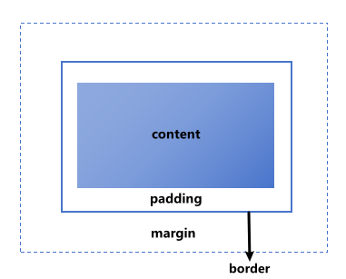
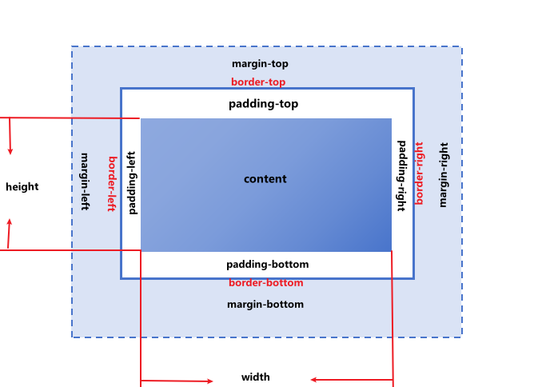
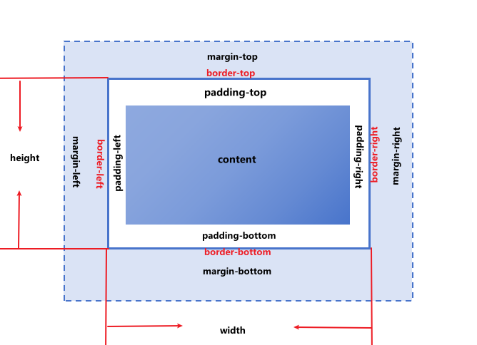

## 盒子模型

### 含义
> 当对一个文档进行布局（layout）,浏览器渲染引擎会根据CSS基础框盒模型（CSS basic box model），将所有元素表示为一个个矩形盒子（box）



- 一个盒子由四大部分组成：content、padding、border、margin
1. content：实际内容，显示文本和图像
2. padding：内边距， 边距到内容得区域，受background属性影响
3. border：边距，围绕内容的一条线或多条线，由粗细、样式、颜色三大块组成
4. margin：外边距，元素外创建额外空白的区域，区域内不能放其他的元素

---
盒子模型分为：**W3C标准盒子模型** 和 **IE怪异盒子模型**

### 标准盒子模型（浏览器默认）


- 盒子总宽度 = width + padding + border + margin
- 盒子总高度 = height + padding + border + margin
- width/height 都只是内容宽度和高度，不包含padding 和 border
- width:100,padding:10,border:1,margin:5,该盒子整体宽度为：100+(2 * 10)+(2 * 1)+(2 * 5) = 132px

### IE怪异盒子模型


- 盒子总宽度 = width + margin
- 盒子总高度 = height+ margin
- width/height 都包含padding 和 border
- width:100,padding:10,border:1,margin:5,该盒子整体宽度为：100+(2 * 5) = 110px,width已经包含了padding和border

### 改变盒子模型（Box-sizing）
CSS的**Box-sizing**属性定义，用哪种盒子模型去计算
```js
box-sizing：content-box | border-box | inherit
```
- content-box：默认值，按照标准盒子模型，即元素的width/height不包含padding 和 border
- border-box：按照IE怪异盒子模型，即元素的width/height包含padding 和 border
- inherit：指定box-sizing属性的值，应该从父元素上继承

```js
<style>
 .box {
    width: 200px;
    height: 100px;
    padding: 20px;
    box-sizing: border-box;
 }
</style>
<div class="box">
    // 盒子模型
</div>
//这时候按怪异盒子模型，width为200px，实际content为200px - 40px = 160px
```

