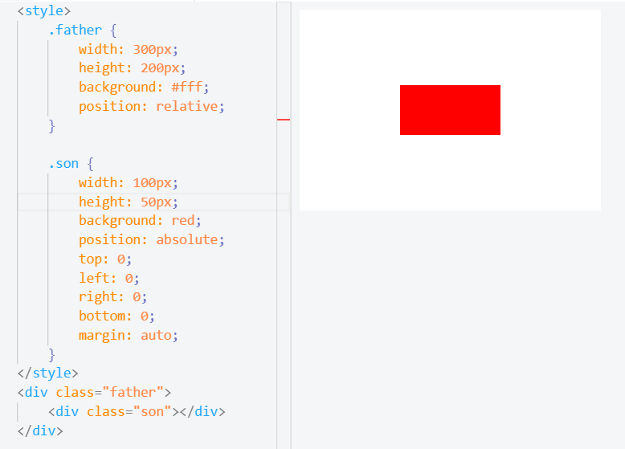
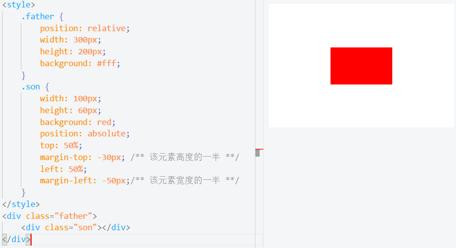
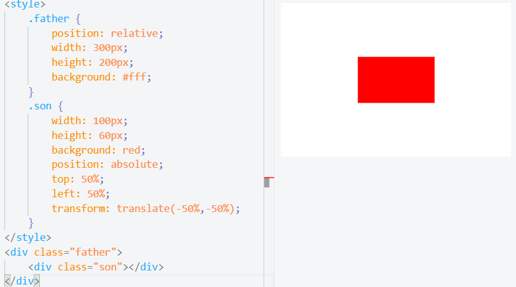
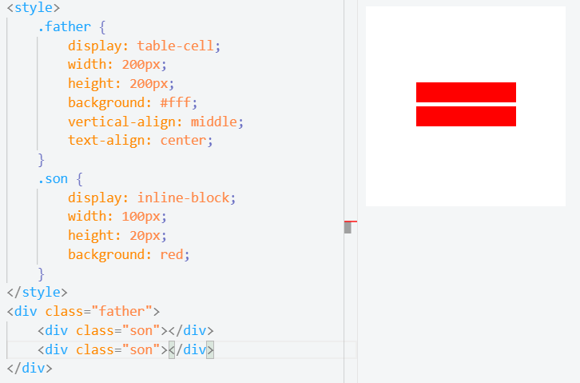
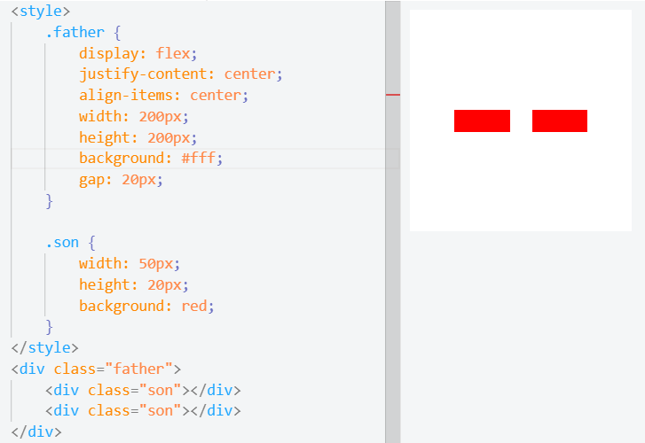
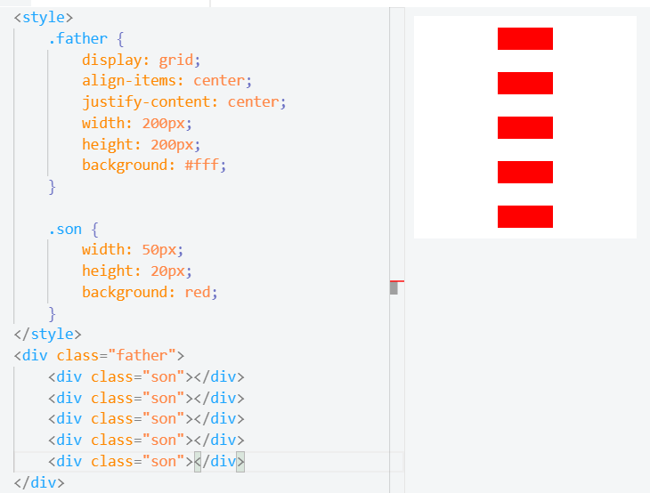

## 水平垂直居中
居中方法分成两个大类：
1. 居中元素(子元素)的宽高已知  
2. 居中元素宽高未知

### 实现方式
实现元素水平垂直居中方式
1. 利用定位 + margin:auto
2. 利用定位 + margin：负值
3. 利用定位 + transform
4. table布局
5. flex布局
6. grid布局

#### 1.定位 + margin：auto
子绝父相 + 四角定位 + margin

#### 2.定位 + margin：负值
子绝父相 + 上左50% + 距离上左，元素宽高的-50%

#### 3.定位 + transform
子绝父相 +  上左50% + transform(-50%, -50%)

#### 4.table布局
父display：table-cell  + 子display： inline-block + vertical、text-align
- 多个垂直居中

#### 5.flex布局
父display：flex + justify-content、align-item
- 多个水平居中 

#### 6.grid网格布局
父display：flex + justify-content、align-item
- 自带间距，多个垂直居中

### 小结
- 不知道宽高的实现方法
1. 定位 + margin：auto
2. 定位 + transform
3. table布局
4. flex布局
5. grid布局

## 总结
元素标签的性质，可以分为：
- 内联元素居中布局
- 块级元素居中布局

#### 内联元素居中布局
水平居中
- 行内元素：text-align:center
- flex布局父：display：flex; justify-content: center
  
垂直居中
- 单行文本父元素已知高度： height === line-height
- 多行文本父元素已知高度：display：table-cell；vertical-align：middle

#### 块级元素居中布局
水平居中
- 定宽： margin: 0 auto;
- 绝对定位 + left： 50% + margin：负元素一半

垂直居中
- position：absolute + left、top、margin-left、margin-top定高
- display：table-cell
- transform：translate(x,y)
- flex(不定高，不定宽)
- grid(不定高，不定宽)，兼容性较差