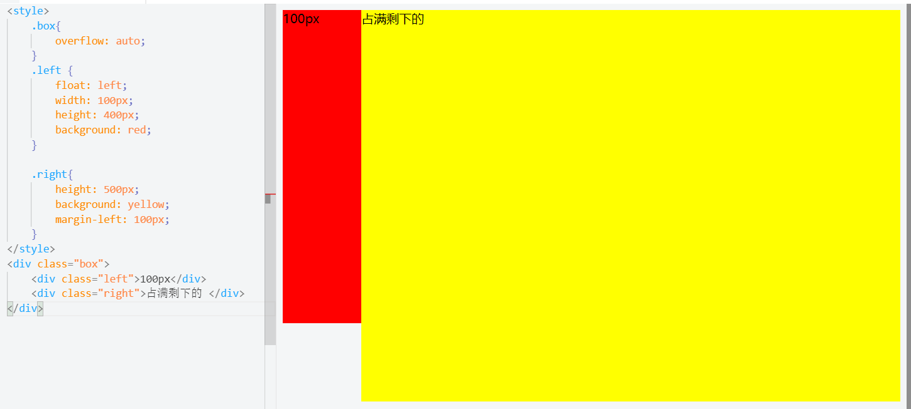
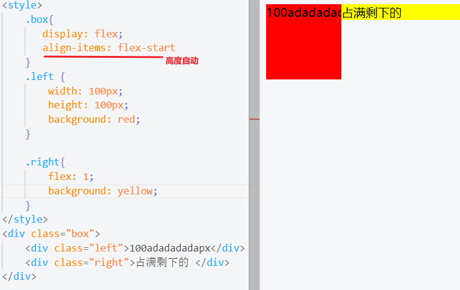
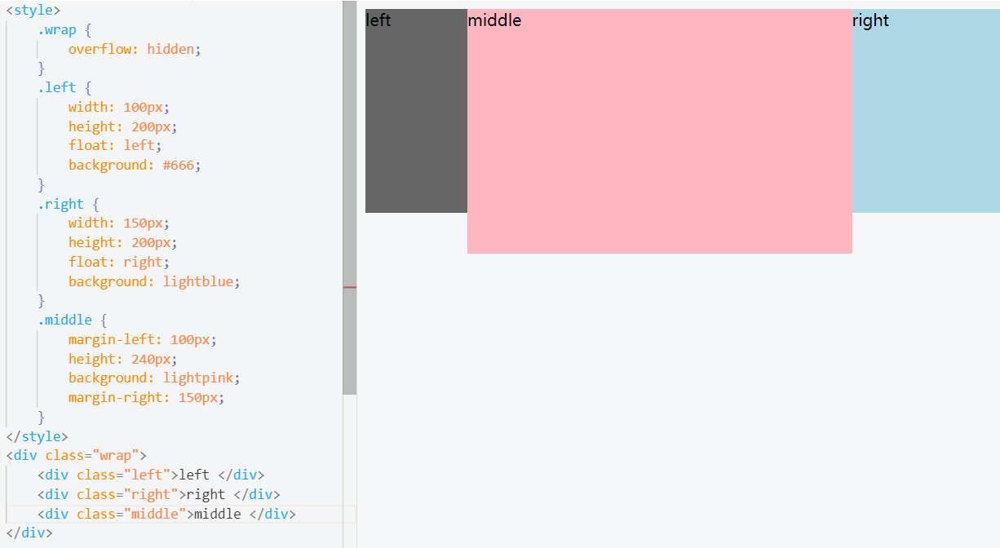
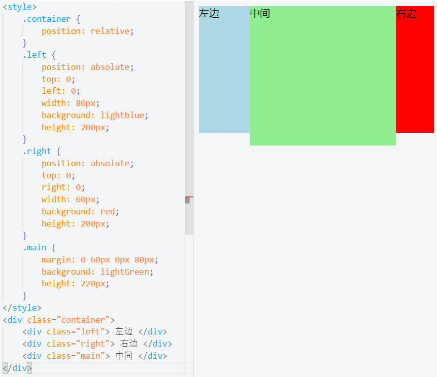
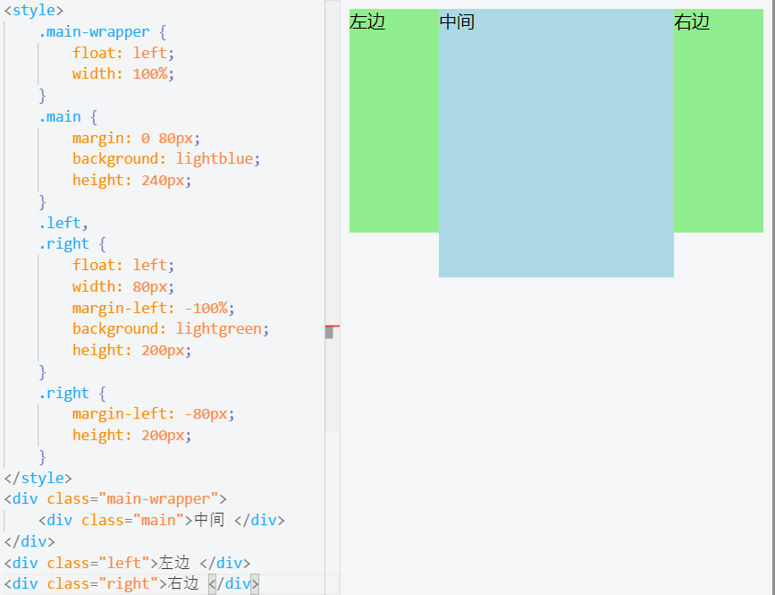
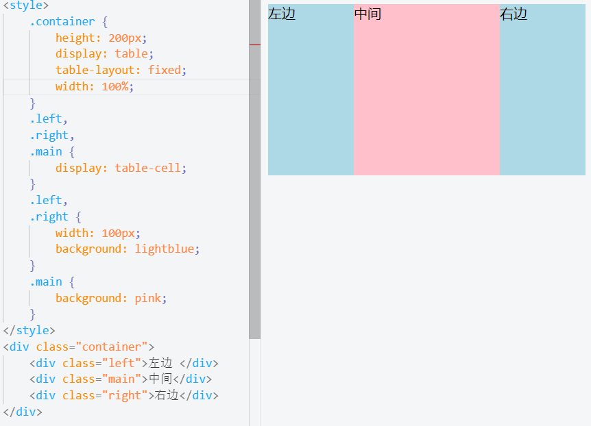
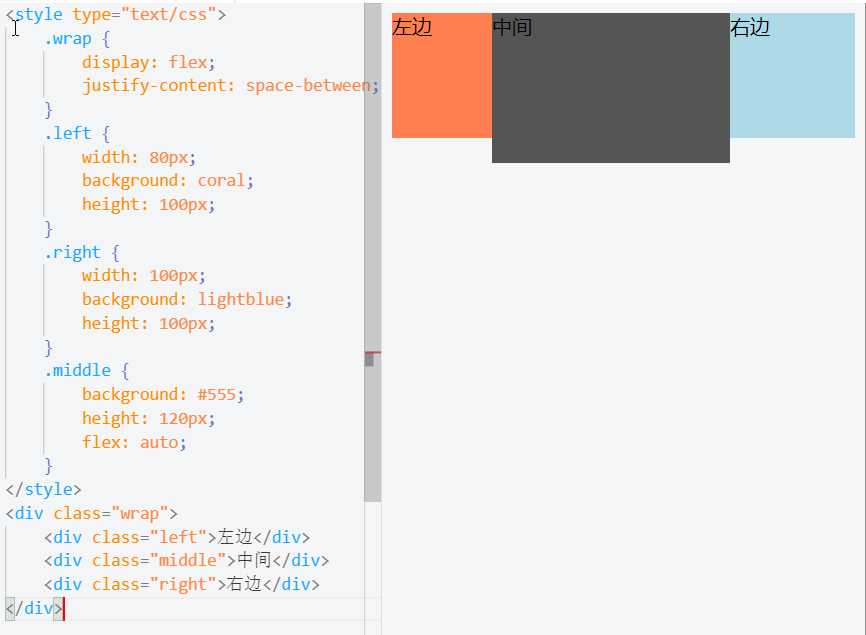
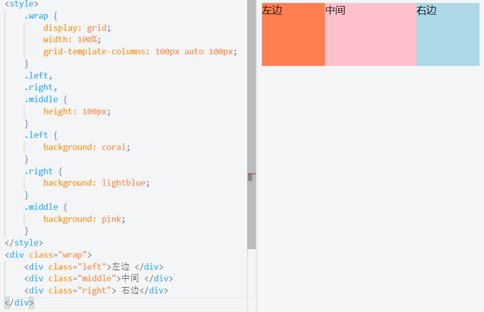

## 两栏
### 思路
目的：实现一个定宽栏 + 一个自适应的栏并排展示存在
1. 使用float左浮 左边栏
2. 右边模块使用margin-left撑出内容块做内容展示
3. 为父级元素添加BFC,防止下方元素飞到上方内容

### flex弹性布局
flex容器有一个默认属性值： align-items：stretch; 会导致列的等高效果
如果想要高度自己控制，需要设置align-items：flex-start

---

## 三栏
### 实现方式
1. 两边float，中间margin
2. 两边absolute，中间margin
3. 两边float和负margin
4. display：table实现
5. flex实现
6. grid网格布局

#### 1. 两边float，中间margin
- 两边固定宽度，中间宽度自适应
- 利用中间元素的margin值控制两边的间距
- 宽度过于小时，会从右边挤下去

- 缺陷
  1. 主体内容最后才加载
  2. 右边在主体内容之前，如果是响应式，则不能进行换行展示

#### 2. 两边absolute，中间margin
> 绝对定位会脱离文档流，相对于最近的已经定位的祖先元素进行定位

- 绝对定位，固定到两侧
- 中间占满一行，通过margin去距离左右两边

#### 3.两边float，负margin
- 中间使用双层标签，外层是浮动的，以便于同一行展示
- 左边使用负 margin-left：-100%，相当于中间的宽度，所以向上偏移到最左侧
- 右边使用负 margin-right：自身宽度，相当于自身宽度，所以向上偏移到最右侧

- 缺点
  1. 增加 .main-wrapper 一层 , 结构变复杂
  2. 使用 负margin，调试也相对麻烦
   
#### 4.使用display：table实现
- 层：dispaly：table 设置为表格，设置table-layout:fixed 表示列宽自身宽度决定，而不是自动计算
- 内层的左中右 通过 display：table-cell设置为表格单元
- 左右设置固定宽度，中间设置width：100% 填充剩下得宽度

#### 5.使用flex实现
- 仅需容器设置为： display：flex
- 元素两端对齐，中间元素设置为100%宽度，或者设置为 flex: 1,填充其空白
- 盒内元素得高度撑开容器的高度

> 结构简单直观，order属性调整显示顺序，让主体内容优先加载，展示在中间

#### 6.gird网格布局

