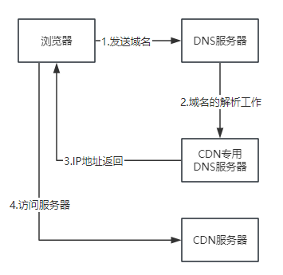

## CDN
> CDN(Content Delivery Network),即内容分发网络

构建在现有网络基础上的智能虚拟网络，依靠部署在各地的边缘服务器，通过中心平台的负载均衡、内容分发、调度等功能模块，使用户就近获取所需内容，减低网络拥塞，提高用户访问响应速度和命中率。

- CDN的关键技术主要是 内容存储和分发技术，简单来说，CDN就是根据用户位置分配最近的资源

### 原理
原本：
> 用户提交域名 -> 浏览器对域名进行解释 -> DNS解析得到目的主机的IP地址 -> 根据IP地址访问发出请求 -> 得到请求数据并回复

使用CDN后
> 不再返回IP地址，而是一个 CNAME （Canonical Name）别名记录，指向CDN得全局负载均衡系统进行智能调度

- 看用户IP地址，查表得知地理位置，找相对最近的边缘节点
- 看用户所在的运营商网络，找相同网络的边缘节点
- 检查边缘节点的负载情况，找负载较轻的节点
- 其他，节点的“健康状态”、服务能力、带宽、响应时间等
结合上面的因素，得到最合适的边缘节点，把节点返回给用户，用户就可以访问CDN的缓存代理

#### 整体流程

1. 浏览器 发送域名 给DNS服务器（加速域名CNAME）
2. DNS服务器 域名解析工作 给CDN专用DNS服务器（CNAME:List<IP地址>）
3. CDN专用DNS服务器 返回IP地址 给浏览器
4. 浏览器 访问服务器 到CDN服务器

#### 缓存代理
缓存系统是CDN的另一个关键组成部分，缓存系统有两个衡量CDN服务质量得指标
- 命中率： 用户访问的资源恰好再缓存系统里，可以直接返回给用户，命中次数与所有访问次数的比例
- 回源率： 缓存里没有，必须用代理的方式回源站取，回源次数与所有访问次数的比例

缓存系统也可以划分出层次，分成一级缓存节点和二级缓存节点。一级缓存配置高一些，直连源站，二级缓存配置低一些，直连用户

回源的时候二级缓存只找一级缓存，一级缓存没有回源站取，可以有效减少真正得回源

### 总结
CDN的目的：是为了改善互联网的服务质量，通俗一点就是提高访问速度

CDN 让用户就近访问专网里的边缘节点，降低了传输延迟，实现了网站加速

通过CDN的负载均衡系统，智能调度边缘节点提供服务，相当于CDN服务的大脑，而缓存系统相当于CDN的心脏，缓存命中直接返回给用户，否则回源