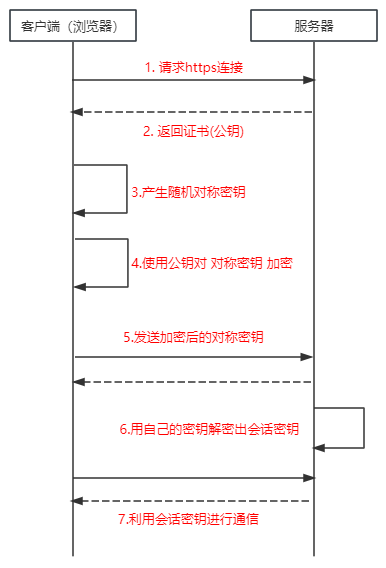

## Http和Https

### Http
> HTTP(HyperText Transfer Protocol),即超文本运输协议，实现网络通信的一种规范

> 计算机中有很多协议，例如，广播协议、路由协议等等。而HTTP是属于传输协议，即数据从A传到B，而他并非是A <=> B，而是中间还有很多层其他第三方的协议 A <=> X <=> Y <=> Z <=> B

> 传输的数据并不是计算机底层中的二进制，而是完整的、有意义的数据。比如HTML文件，图片文件这种能被上层应用识别

#### Http特点
1. 明文传递：以明文方式发送内容，不提供任何方式的数据加密
2. 支持客户端/服务端模式：HTTP常被用于Web浏览器和网站服务器之间传递信息
3. 简单快速，客户端向服务端发送请求，只需要传送请求方法和路径。由于HTTP协议简单，使得Http服务器的程序规模小，因而通信速度快
4. 灵活，HTTP允许传输任意类型的数据对象。正在传输的类型由Content-Type加以标记
5. 无连接：无连接的含义是限制每次连接只处理一个请求。服务器处理完客户的请求，并收到客户端的应答后，即断开连接。采用这种方式来节省传输时间
6. 无状态：HTTP协议无法根据之前的状态进行本次的请求处理
   
---

### HTTPS
> 正是因为Http传递信息是以明文的形式发送内容，则并不安全，所以有了 HTTPS

> HTTPS = HTTP协议 + SSL/TLS协议, SSL证书是用来验证服务器身份，让浏览器和服务器之间通信加密

> SSL协议是位于TCP/IP协议与各种应用层协议之间，SSL的建立需要选择一组恰当的加密算法来实现安全通信，为数据通信提供安全支持（密钥A加密，密钥B解密）

#### SSL过程
1. 客户端通过URL访问服务器建立SSL连接
2. 服务端收到客户端请求后，会将网站支持的证书信息（包含公钥）传送给客户端
3. 客户端的服务器协商SSL连接的安全等级，也就是信息加密的等级
4. 客户端的浏览器根据双方同意的安全等级，建立会话密钥，然后利用网站的公钥将会话密钥加密，
5. 把加密好密钥传送给网站
6. 服务器利用自己的私钥解密出会话密钥
7. 服务器利用会话密钥加密与客户端之间的通信

---

## HTTPS和HTTP区别
- HTTPS和HTTP协议的安全版本，HTTP协议的数据传输是明文的，是不安全的，HTTPS使用了HTTP+SSL/TLS协议进行加密处理，相对安全
- HTTP和HTTPS使用连接方式不同，默认端口也不一样，HTTP是80，HTTPS是443
- HTTPS需要多次加密解密，性能方面不如HTTP
- HTTPS需要SSL，SSL证书需要钱

