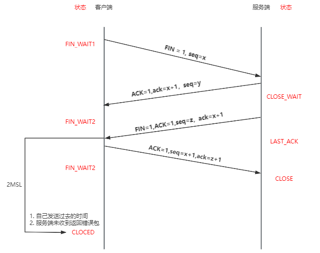

## 三次握手四次挥手
### 三次握手
> 三次握手（Three-way Handshake）建立一个TCP连接时，需要客户端和服务器总共发送3个包

- 作用：为了确认双方的接收能力和发送能力是否正常、指定自己的初始化序列号为后面的可靠性传送做准备

#### 过程
1. 第一次握手：客户端给服务端发一个**SYN**报文，并指明客户端的初始化序列号ISN(c),这时客户端处于**SYN_SENT** 状态
2. 第二次握手：服务器收到客户端的 SYN 报文之后，会以自己的 **SYN** 报文作为应答，为了确认客户端的 SYN，将客户端的 ISN+1 作为**ACK**的值，这时服务器处于 **SYN_RCVD** 的状态
3. 第三次握手：客户端收到 SYN 报文之后，会发送一个 **ACK** 报文，值为服务器的 ISN+1 。这时客户端处在 **ESTABLISHED** 状态。服务器收到 ACK 报文之后，也处于 **ESTABLISHED** 状态，这时双方已建立起了连接

- 作用
1. 第一次握手：客户端发包，服务端接收
   - 服务端得到结论：客户端发送正常
2. 第二次握手：服务器发包，客户端接收
   - 客户端得到结论：服务端的发送、接收正常
   - 不过此时 服务端并不能确认客户端的接收是否正常
3. 第三次握手：客户端发包，服务端接收
   - 服务端得到结论：客户端的发送、接收正常，服务器发送、接收正常

通过三次握手，确定了双方的发送、接收能力都是正常的，之后就可以正常通话了

#### 为啥不能是2次握手
2次握手，客户端能确认服务端发送和接收能力正常，而服务端只能确认客户端的发送正常，无法确认对方的接收是否正常.

2次握手，客户端有可能因为网络阻塞等原因，会发送多个请求报文，延时到达的请求又会与服务器重新建立链接，从而浪费服务器资源

--- 

### 四次挥手
> 四次挥手，终止一个TCP链接，需要经过四次挥手

#### 过程
- 第一次挥手：客户端发送一个 **FIN** 报文，报文中会指定一个序列号，这时客户端处于**FIN_WAIT1**状态，停止发送数据，等待服务端的确认
- 第二次挥手：服务端收到 **FIN** 后，会发送**ACK**报文，并把客户端的序列号+1作为ACK报文的序列值，表明收到客户端的报文，这时服务端处于 **CLOSE_WAIT**状态
- 第三次挥手：如果服务端也想断开链接，服务端会再次像客户端发送 **FIN**报文，并指定一个新的序列号，这时服务端处于 **LAST_ACK** 状态
- 第四次挥手：客户端收到 **FIN**之后，发送一个 **ACK**报文做应答，并把服务端的序列号值+1作为ACK报文的序列值，这时客户端处于 **TIME_WAIT** 状态。需要过2个时间段再进入到**CLOSED**状态，而服务端收到ACK报文就进入 **CLOSED** 状态

#### 四次挥手的原因
服务端在接收客户端断开**FIN**报文后，并不会立刻关闭，会先发送一个**ACK**包先告诉客户收到关闭链接的请求，当服务端的所有报文都发送完毕，关闭之前的准备做好之后，再发生一个**FIN**报文断开链接，因此需要4次挥手。