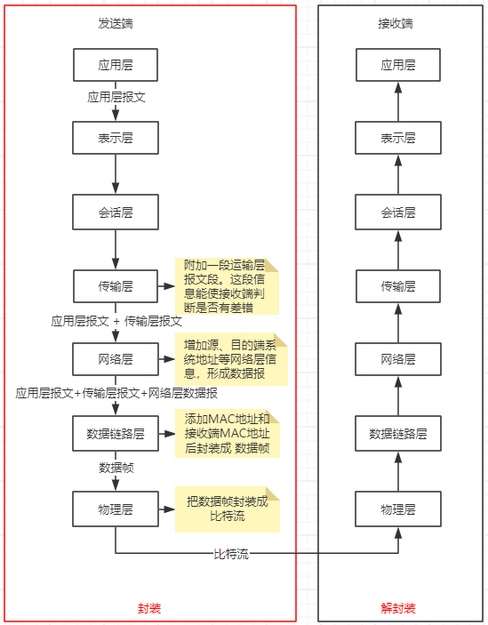

## OSI七层模型
### 定义
> OSI（Open System Interconnect）开放式通信系统互连参考模型。世界范围内互联的标准框架，一共划分了7层，分别是： 1. 应用层 2.表示层 3.会话层 4.传输层 5.网络层 6.数据链路层 7.物理层

#### 1. 应用层
- 作用： 通过应用程序间的交互来完成特定的网络应用
- 定义了应用进程之间的交互规则，在应用层交互的数据我们称之为 **报文**

#### 2. 表示层
- 作用： 使通信的应用程序能够解释交换数据的含义， 向上为应用层提供服务，向下接收会话层的服务
- **表示层**提供的服务主要有：数据压缩，数据加密以及数据描述，使应用程序不用担心表示差异和存储内部格式的差异

#### 3. 会话层
- 作用：负责建立、管理、终止和表示层实体之间的通话会话
- **会话层**提供了数据交换的定界和同步功能，包括建立检查点、恢复方案的方法

#### 4. 传输层
- 作用：为两台主机进程之间的通信提供服务，包括处理数据包错误，数据包次序，以及一些关键的传输问题
- **传输层**向高层屏蔽了下层数据通信细节，这是很关键的层，主要的传输层协议是 TCP 和 UDP

#### 5. 网络层
- 作用：选择合适的网间路由和交换节点，确保数据按时成功传送
- **网络层**把从传输层产生的报文或用户数据封装成分组和包，向下传输到数据链路层
- **网络层**使用的协议是 无连接的网际协议（Internet Protocol）和许多路由协议，所以也称这层为 IP层

#### 6. 数据链路层
- 作用：在两个相邻的节点之间传送数据，数据链路层将网络层交下来的**IP数据报**组成帧，在两个相邻节点间的链路上传送帧
- 两台主机之间的数据传输，总在一段一段的链路上传送，这需要**专门的链路层协议**
  
每一帧的数据都可以分成： **报头head** 和 **数据data** 两部分
- head标明数据发送者、接收者、数据类型，如MAC地址
- data存储了计算机之间的交互的数据
通过控制信息能检测到收到的帧是否有差错，如果有差错，链路层能简单得丢掉这个帧，以避免继续占有网络资源

#### 7. 物理层
- 作用：实现计算机节点之间比特流的透明传送，这层主要和硬件有关系。
- 该层主要是确定与传输媒体的接口的一些特性（机械特性、电气特性、功能特性、过程特性）

