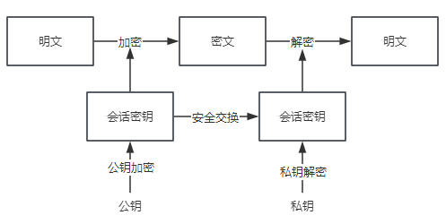

## HTTPS的安全性
### 安全特性
- 通信使用明文（不加密），内容可能会被窃听
- 不验证通信方的身份，因此有可能遭遇伪装

> HTTPS = HTTP协议 + SSL/TLS协议

> SSL(Secure Sockets Layer)安全套接字协议，及继任者传输层安全TLS（Transport Layer Security）是为网络通信提供安全及数据完整性的一种安全协议

TSL/SSL是在HTTP协议和TCP协议之间中处理的，面对 **信息窃听、篡改、劫持**， 具备 **信息加密、完整性校验、身份验证**

### SSL 加密手段
1. 对称加密： 采用协商的密钥对数据进行加密
2. 非对称加密： 实现身份认证和密钥协商
3. 摘要算法：验证信息的完整性
4. 数字签名：身份验证

#### 1. 对称加密
> 对称加密指的是 加密和解密使用的秘钥都是同一个，是对称的。只要保证了密钥的安全，那整个通信过程就有机密性

- 明文 =(对称密钥加密)=> 密文 =(对称密钥解密)=> 明文

#### 2. 非对称加密
> 非对称加密， 存在两个秘钥，一个叫公钥，一个叫私钥。两个秘钥是不同的，公钥可以公开给任何人使用，私钥则需要保密。公钥和私钥都可以用来加密解密，但公钥加密后只能用私钥解，反过来私钥加密也只能公钥解密。

- 明文 =(公钥加密，任何人可用)=> 密文 =(私钥解密)=> 明文

#### 3. 混合加密
> 在HTTPS通信中，采用对称加密+非对称加密，也就是混合加密

HTTPS采用非对称加密解决密钥交换的问题：
发送密文的一方使用对方的公钥进行加密处理"对称的密钥"，然后用自己的私钥解密拿到"对称的密钥"

- 例子
网站秘密保管私钥，在网上任意发公钥，在登陆网站只要用公钥加密，密文只能由私钥才能解密，黑客没有私钥，就无法破解密文。
如果一开始黑客就伪造身份发布公钥，你获取的假公钥，那么混合加密要没用。所以需要在这个基础上加上 **机密性、完整性、身份认证**

HTTPS解决了以下问题：
1. 机密性：混合加密
2. 完整性：摘要算法
3. 身份认证：数字签名
4. 不可否认：数字签名
---

### 摘要算法
> 完整性主要是用 摘要算法来实现，就是常说的：散列函数、哈希函数

- 可以理解成一种特殊的压缩算法，能够把任意长度的数据“压缩”成固定长度，而且是独一无二的“摘要字”字符串，就好像给这段数据生成一个数字**指纹**

### 数字签名
> 数字签名能确定消息是由发送方签名并发出来的，因为别人假冒不了发送方的签名
- 原理：私钥加密，公钥解密

