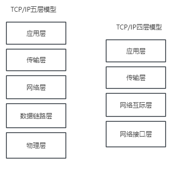

## TCP/IP协议
### 定义
> TCP/IP，传输控制协议/网际协议，指能够在多个不同网络间实现信息传输的协议簇

- tcp（传输控制协议）：一种面向连接的、可靠的、基于字节流的传输层通信协议
- IP（网际协议）：用于封包交换数据网络协议

TCP/IP协议不仅仅只是TCP和IP两个协议噢，而是指一个由 FTP、SMTP、TCP、UDP、IP等协议构成的协议簇，其中TCP和IP是最具有代表性的，所以我们称为 TCP/IP协议

### 划分
TCP/IP协议簇按层次分了 五层模型 或 四层模型
- 五层模型包括：应用层、传输层、网络层、数据链路层、物理层 （网络原理）（综合OSI和TCP/IP优点的一种协议）
- 四层模型包括：应用层、传输层、网络层、网络接口层 （实际应用）

### 五层体系
#### 1. 应用层
TCP/IP模型将 OSI 参考模型中的 应用层、表示层、会话层的功能合并到一个应用层实现，通过不同的应用层协议为不同的应用提供服务，比如 FTP, DNS, SMTP, Telnet

#### 2. 传输层
作用： 为上层实体提供源端到对端主机的通信功能
该层主要定义了两种主要协议：传输控制协议（TCP）和用户数据报协议（UDP）
其中**面向连接的TCP协议保证了数据的传输可靠性**， **面向无连接的UDP协议能够实现数据包简单、快速的传输**

#### 3. 网络层
负责为分组网络中不同主机提供通信服务，选择合适的路由将数据传递到目标主机

#### 3. 数据链路层
两个相邻节点传输数据，会将网络层交下来的IP数据报组装成帧，在两个相邻节点之间的链路上传送帧

#### 4. 物理层
保证数据在各个物理媒介上进行传输，为数据的传输提供可靠的环境

### 四层体系
| 层次名称   | 单位   | 功能                     | 协议                  |
| ---------- | ------ | ------------------------ | --------------------- |
| 应用层     |        | 对应OSI参考模型的前3层   | FTP\HTTP\DNS\SMTP\NFS |
| 传输层     | 报文段 | 负责提供传输服务         | TCP\UDP               |
| 网络互际层 | 数据报 | 负责网络间的寻址数据传输 | IP\ICMP\ARP\RARP      |
| 网络接口层 | 帧     | 负责实际数据的传输       | HDLC\PPP\SLIP         |

---
## TCP和UDP的区别是什么
### TCP
> TCP（Transmission Control Protocol），传输控制协议，是一种可靠、**面向节点流的通信协议**

TCP会把应用层传下来的数据 看成 **无结构的字节流** 来发送，TCP报文首部有20个字节，额外开销大

- 特点：
1. TCP充分实现了数据传输时的各种控制功能，可以进行丢包时的重发控制，可以对次序乱掉的分包进行顺序控制。这些在UDP都没有
2. TCP作为面向有链接的协议，只有在确认通信对端存在时才会发送数据，从而控制通信流量的浪费
3. 根据TCP的这些机制，在IP这种无连接的网络上也能实现高可靠性的通信（主要通过检验和序列号、确认应答、重发控制等机制实现）

### UDP
> UDP(User DataGram Protocal),用户数据包协议，一个简单的 **面向数据报的通信协议**，即对应用层交下来的报文，不合并，不拆分，只**添加首部**

无论应用层交UDP多长的报文，它都一次发送一个报文，直到发送完成位置。
而接收方直接去掉首部，再交给应用层就完成任务了

UCP报头包含4个字段，每个字段占用2个字节，标题短，开销大

- 特点
1. UCP不提供复杂的控制机制，利用IP提供面向无连接的通信服务
2. 传输途中出现丢包，UCP也不会负责重发
3. 当包到达顺序出现乱序，UCP没有纠正功能
4. 收到什么发送什么，即使在网络拥堵的情况，UCP也无法进行流量控制等避免网络拥塞行为

### UDP和TCP的区别
| 层次名称 | TCP          | UDP                            |
| -------- | ------------ | ------------------------------ |
| 可靠性   | 高可靠       | 不可靠                         |
| 连接性   | 面向连接     | 无连接                         |
| 报文     | 面向字节流   | 面向报文                       |
| 效率     | 传输效率低   | 传输效率高                     |
| 双共性   | 点对点全双工 | 一对一、一对多、多对一、多对多 |
| 流量控制 | 能进行控制   | 无                             |
| 拥塞控制 | 拥塞避免     | 无                             |

- TCP是面向链接的协议，需要经过 **3次握手和四次挥手**
- UCP是面向无连接的，数据在传输前后不进行连接，**发送端只负责把数据发送到网络**，而**接收端只负责将数据从消息队列中读取**
  
- TCP提供**可靠的传输服务**，传输过程中采用 流量控制、编号确认、计时器等手段**确保数据无差错，不丢包**。
- UCP的**可靠性较低**，只负责尽可能传输数据，但并**无法保证能无差错交付给对方**

- TCP**面向字节流**，会将应用层下来的报文看成一串无结构得字节流，分解为多个TCP报文进行传输，接收端收到后，需要去组装多个TCP报文
- UDP**面向报文**，不拆分应用层下来报文，只**添加首部**，一次发送一个报文，接收端需要去掉报文首部，原封不动上交给应用层

- TCP只支持**点对点全双工通信**
- UDP支持**一对一、一对多、多对一、多对多得交互通信**

### 应用场景
| 应用层协议 |              | 传输协议 |
| ---------- | ------------ | -------- |
| SMTP       | 电子邮件     | TCP      |
| TELNET     | 远端终端接入 | TCP      |
| HTTP       | 超文本传输   | TCP      |
| FTP        | 文本传输     | TCP      |
| -          | -            | -        |
| DNS        | 域名转换     | UDP      |
| TFTP       | 文件传输     | UDP      |
| SNMP       | 网络管理     | UDP      |
| NFS        | 拥塞避免     | UDP      |