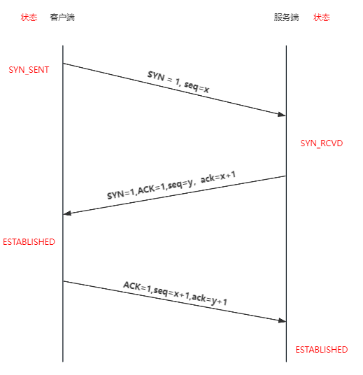

## 输入URL到回车后

1. URL解析
2. DNS查询
3. TCP连接
4. HTTP请求
5. 响应请求
6. 页面渲染

### 1. URL解析
协议 + 域名 + 端口 + 路径 + 携带字符串信息 + 锚点链接

协议： http 、https
域名：对应IP地址， 确定服务器
端口：默认80，确定服务器具体应用
路径：确定本次访问资源的位置
携带字符串信息 + 锚点链接： 对请求资源做更详细的描述

https：// 1.511.154.102:80/home?id=1234#test

### 2. DNS查询
1. 搜索浏览器DNS缓存，缓存中维护一张域名和IP地址的对应表
2. 若没有命中，则继续搜索操作系统的DNS缓存
3. 若仍然没有命中，则操作系统将域名发送至本地域名服务器，本地域名服务器采用**递归查询**自己的DNS缓存，查找成功则返回结果
4. 若本地域名服务器的DNS缓存没有命中，则本地域名服务器会向上级域名服务器进行**迭代查询**
    - 首先本地域名服务器向根域名服务器发起请求，根域名服务器返回顶级域名服务器的地址给本地服务器
    - 本地域名服务器拿到这个顶级域名服务器地址后，就向其发起请求，获取权限域名服务器的地址
    - 本地域名服务器根据权限域名服务器地址向其发送请求，最终得到该域名对应的IP地址
5. 本地域名服务器将得到IP地址返回给操作系统，同时自己将IP地址缓存起来
6. 操作系统将IP地址返回给浏览器，同时自己也将IP地址缓存起
7. 浏览器得到域名对应的IP地址，并将IP地址缓存起

### 3. TCP连接(三次握手)
1. 第一次握手：客户端给服务端发一个**SYN**报文，并指明客户端的初始化序列号ISN(c),这时客户端处于**SYN_SENT** 状态
2. 第二次握手：服务器收到客户端的 SYN 报文之后，会以自己的 **SYN** 报文作为应答，为了确认客户端的 SYN，将客户端的 ISN+1 作为**ACK**的值，这时服务器处于 **SYN_RCVD** 的状态
3. 第三次握手：客户端收到 SYN 报文之后，会发送一个 **ACK** 报文，值为服务器的 ISN+1 。这时客户端处在 **ESTABLISHED** 状态。服务器收到 ACK 报文之后，也处于 **ESTABLISHED** 状态，这时双方已建立起了连接

### 4. HTTP请求
建立TCP连接后，进行通信，浏览器发送**http**请求到目标服务器

请求的内容包含：
- 请求行
- 请求头
- 请求主体

1. 请求方法 POST/GET/PUT
2. 请求URL
3. HTTP协议和版本
4. 报文头
5. 报文体

### 5. 响应请求
当服务器接收到浏览器的请求之后，就会返回一个HTTP响应包

- 状态行： 200
- 响应头
- 响应正文

在服务器响应后，http就默认开始长连接keep-alive，当页面关闭后，TCP链接则经过四次挥手完成断开

### 6. 页面渲染
浏览器接收到服务器响应的资源后，会对资源进行解析

- 查看响应头的信息，根据不同的指示去做对应的处理（重定向、存储cookie、强制缓存）
- 查看响应头的Content-Type的值，根据不同的资源类型采用不同的解析方式

渲染过程
1. 解析HTML，构建DOM树
2. 解析CSS，生成CSS规则树
3. 合并DOM树和CSS规则树，生成render树
4. 布局render树（Layout/reflow），负责各元素尺寸、位置的计算
5. 绘制render树（paint），绘制页面像素信息
6. 浏览器会将各层的信息发送给GPU，GPU会将各层合成，显示在屏幕上
