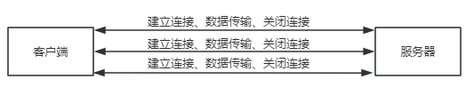

## HTTP1.0/1.1/2.0
### HTTP1.0
> HTTP协议的第二个版本，第一个在通讯中指定版本号的HTTP协议版本

HTTP1.0浏览器与服务器只保持短暂的连接，每次请求都需要与服务器建立一个TCP连接，服务器处理完成后立即断开TCP连接，服务器不跟踪每个客户也不记录过去的请求。 就是 **每次与服务器交互，都需要新开一个连接**

所以在交互时，需要多次建立连接、数据传输、关闭连接，这明显造成了性能上的缺陷，如果建立长连接，则需要设置一个Connection字段，Connection：keep-alive

---

### HTTP1.1
HTTP1.1中，默认支持长连接（Connection： keep-alive），即在一个TCP连接上可以传送多干活HTTP请求和响应，减少建立和关闭连接的消耗和延迟。即 **建立一次连接，可以多次传送数据**

同样HTTP1.1还允许客户端不用等待上一次请求结果返回，就可以发出下一次请求了。但服务器端必须按照先后顺序依次返回数据。这种方式大大减少了整个下载课程所需要的时间

- 同时，新增了很多请求头和响应头来完善功能
1. 引入更多的缓存控制策略，如If-Unmodified-Since，If-Match，If-None-Match等缓存头来控制缓存策略
2. 引入range，允许值请求资源某个部分
3. 引入host，实现了一台WEB服务器上可以在同一个IP地址和端口号上使用不同的主机名来创建多个虚拟web站点
4. 添加了其他请求方式： put、delete、options...

### HTTP2.0
