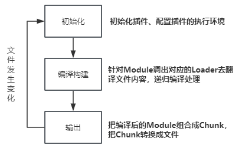

## 构建流程

> webpack的运行流程是一个串行的过程，它的工作流程就是把各个插件串起来使用。在运行过程中的广播事件，插件只需要监听它所关心的事情，就能够加入到webpack的机制中，去改变webpack的运作，使得整个系统扩展性良好

从启动到结束会走三大步骤
1. 初始化流程： 从配置文件和Shell语句中读取与合并参数，并初始化需要使用的插件和配置插件的执行环境所需要的参数
   
2. 编译构建流程：从Entry出发，针对每个Module串行调用对应的Loader去翻译文件内容，再找到该Module依赖的Module，递归地进行编译处理
   
3. 输出流程：对编译后的Module组合成Chunk，把Chunk转换成文件，输出到文件系统



---

### 1. 初始化流程

从配置文件和**Shell**语句中读取与合并参数，得到最终的参数
配置文件默认下为 **webpack.config.js**，也或者通过命令的形式指定配置文件，主要作用是用于激活webpack的加载项和插件

```js
var path = require('path')
var node_modules = path.resolve(__dirname,'node_modules')
var pathToReact = path.resolve(node_modules,'react/dist/react.min.js')

module.exports = {
    // 1. 入口文件: 是模块构建的起点，同时每一个入口文件对应最后生成的一个chunk
    entry: './path/entry/file.js'
    // 2. 文件路径指向(加快打包过程)
    resolve:{
        alias:{
            'react':pathToReact
        }
    }
    // 3. 生成文件：是模块构建的终点，包括输出文件与输出路径
    output:{
        path:path.resolve(__dirname,'build'),
        filename: '[name].js'
    },
    // 4. 配置处理各模块的loader，包括css预处理loader，es6编译loader，图片处理loader
    module:{
        loaders:[{
            test:/\.js$/,
            loader: 'babel',
            query:{
                presets:['es2015','react']
            }   
        }],
        noParse:[pathToReact]
    }
    // 5.webpack 各插件对象，在webpack的事件流中执行对应的方法
    plugins：[
        new webpack.HotModuleReplacementPlugin()
    ]
}
```

webpack 会将 webpack.config.js 各个配置项拷贝到 **options** 对象中，并加载用户配置的plugins
完成上述步骤之后，则开始初始化**Compiler**编译对象，该对象掌握着webpack的生命周期，不执行具体的任务，只进行调度工作

```js
class Compiler extends Tapable{
    constructor(context){
        super()
        this.hooks = {
            beforeCompile: new AsyncSeriesHook(["params"]),
            compile: new SyncHook(["params"])
            afterCompile:new AsyncSeriesHook(["compilation"])
            make: new AsyncParallelHook(["compilation"])
            entryOption: new SyncBailHook(["context","entry"])
            // 定义了不同类型的钩子
        }
    }
}

function webpack(options){
    var compiler = new Compiler()
    ...// 检查options，若watch字段为true，则开启watch线程
    return compiler
}
```
Compiler 对象继承自 Tapable，初始化定义了很多钩子函数

### 2. 编译构建流程
根据入口文件
```js
module.exports = {
    entry:'./src/file.js'
}
```
初始化后调用Compiler的run来真正启动webpack编译构建流程，流程如下
- 2.1 compile 开始编译
- 2.2 make 从入口点分析模块及其依赖得模块，创建这些模块对象
- 2.3 build-module 构建模块
- 2.4 seal 封装构建结果
- 2.5 emit 把各个chunk输出到结果文件

##### 2.1compile编译
执行了**run**方法后，会触发**compile**, 主要构建一个 **Compilation** 对象
该对象是编译阶段的主要执行者，主要会依次下述流程：执行模块创建、依赖收集、分块、打包等主要任务的对象

##### 2.2make编译模块
当完成了上述的**compilation**对象后，就开始从**Entry入口文件**开始读取，主要执行 **_addModuleChain()** 函数

```js
_addModuleChain(context, dependency, onModule, callback) {
    ...
    // 
    const Dep = /** @type {DepConstructor} */ (dependency.constructor);
    const moduleFactory = this.dependencyFactories.get(Dep);

    // NormalModuleFactory create NormalModule
    moduleFactory.create({
        dependencies: [dependency]
        ...
    }, (err, module) => {
        ...
        const afterBuild = () => {
            this.processModuleDependencies(module, err => {
                if (err) return callback(err);
                callback(null, module);
            });
        };

        this.buildModule(module, false, null, null, err => {
            ...
            afterBuild();
        })
    })
}
```
_addModuleChain 中接收参数dependency 传入的入口依赖，使用对应的工厂函数NormalModuleFactory.create方法生成一个空的module对象

回调中会把此module 存入 compilation.modules 对象和 dependencies.module对象中，由于是入口文件，也会存入compilation.entries中

随后执行 buildModule 进入真正的构建模块module 内容的过程

##### 2.3 build-module 构建模块
这主要调用配置loaders，将我们的模块转成标准的JS模块

在用Loader 对一个模块转换完成后，用acorn解析转换后的内容，输出对应的抽象语法树（AST），以方便Webpack 后面对代码的分析

从配置的入口模块开始，分析其AST，当遇到require等导入其他模块语句时，将其加入到依赖的模块列表，同时对新找出的依赖模块递归分析，最终搞清所有模块的依赖关系


### 3. 输出流程
##### 3.1 seal输出资源
seal方法主要是生成chunks，对chunks进行一系列的优化操作，并生成要输出的代码，
webpack的chunk，可理解为配置在entry中的模块，或者是动态引入的模块

根据入口和模块之间的依赖关系，组装成一个个包含多个模块的Chunk，再把每个Chunk转换成一个单独的文件加到输出列表中

##### 3.2 emit输出完成
在确定输出内容后，根据配置确定输出路径和文件名
```js
output:{
    path: path.resolve(__dirname, 'build'),
    filename:'[name].js'
}
```
在Compiler开始生成文件前，钩子emit会被执行，这是我们修改最终文件得最后一个机会，从而webpack整个打包过程则结束了


## 总结
1. entry-option：初始化option
2. run：开始编译
3. make：从entry开始递归
4. before-resolve：对模块位置进行解析
5. build-module：开始构建某个模块
6. normal-module-loader： 将loader加载完成的module进行编译，生成AST树
7. program：遍历AST，当遇到require等一些调用表达式时，收集依赖
8. seal：所有依赖build完成，开始优化
9. emit：输出到dist目录