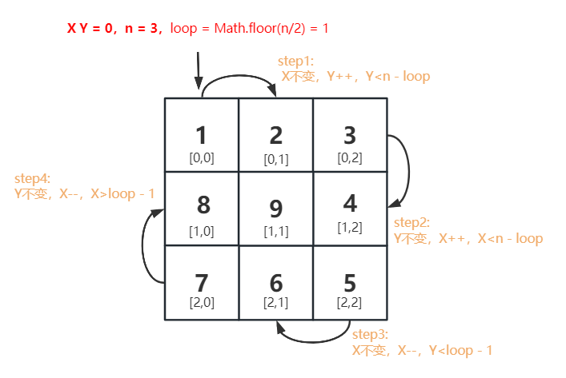
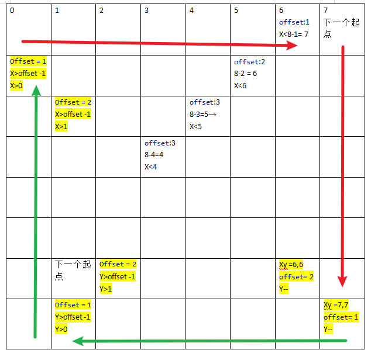

## 螺旋矩阵 II

### 力扣练习题[(戳一戳 ->)](https://leetcode.cn/problems/spiral-matrix-ii/)

> 给你一个正整数 n ，生成一个包含 1 到 n2 所有元素，且元素按顺时针顺序螺旋排列的 n x n 正方形矩阵 matrix

###### -示例1
```
输入：n = 3
输出：[[1,2,3],[8,9,4],[7,6,5]]
```
###### -示例2
```
输入：n = 1
输出：[[1]]
```

---

###### -思路1: 循环不变量


- step1: 如图解，要遵循循环不变量原则
- step2: 定义X,Y坐标值 startX = startY = 0;
- step3:  一圈一循环，定义需要转的圈数，let loop = Math.floor(n/2) ,向下取值，考虑奇数问题
- 示例 n = 4
- step4：一圈循环，遍历横向上边,XY都从0开始，Y坐标变化Y++，直到Y> n - loop, 这时[X,Y] = [0,3]
- step5：一圈循环，遍历竖向右遍,X坐标变化X++，直到X>n-loop,这时XY最大, 这时[X,Y] = [3,3]
- step6：一圈循环，遍历横向下边,Y坐标变化Y--，直到Y < loop -1 , 这时[X,Y] = [3,0]
- step7：一圈循环，遍历竖向左遍,X坐标变化x--，直到X < loop -1 , 这时[X,Y] = [0,0],回到原位
- step8: 一圈循环结束之后，进行下一圈循环，XY++，loop++；
- step9：考虑奇数，奇数最后的值肯定放到最中间 mid = Math.floor(n/2)，如N=3 mid=[1,1] mid=5 mid[2,2]
```js
var generateMatrix = function(n) {
    let startX = startY = 0; // 起始位置
    let count = 1;
     // 1. 我们要转多少圈 loop =  n / 2
     let loop = Math.floor(n/2) // 考虑一下奇偶数问题
     let offset = 1 // 每圈不需要填写的圈数
    let res = new Array(n).fill(0).map(() => new Array(n).fill(0) )
    while(loop--){
        // 遍历横向上遍
        for(;startY<n-offset;startY++){
            res[startX][startY] = count++;
        }
        // 遍历竖向右遍
        for(;startX<n-offset;startX++){
            res[startX][startY] = count++;
        }
        // 遍历横向下遍
        for(;startY>offset - 1;startY--){
            res[startX][startY] = count++;
        }
         //  遍历竖向左遍
        for(;startX>offset-1;startX--){
            res[startX][startY] = count++;
        }
        offset++
        startX++
        startY++
    }
    if(n%2 === 1 ){
        // 奇数问题
        const mid = Math.floor(n/2)
         res[mid][mid] = count;

    }
     return res
};
```