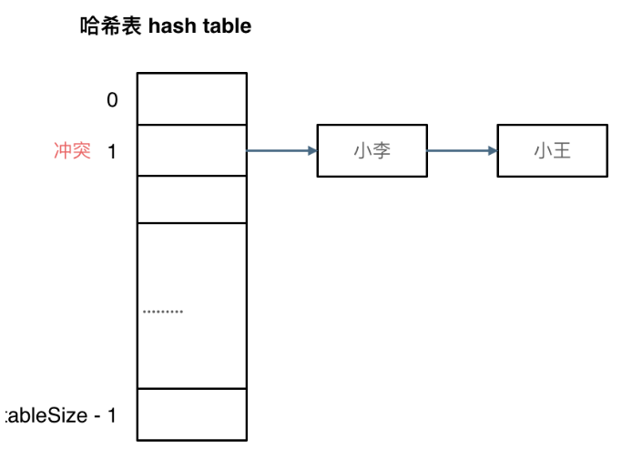
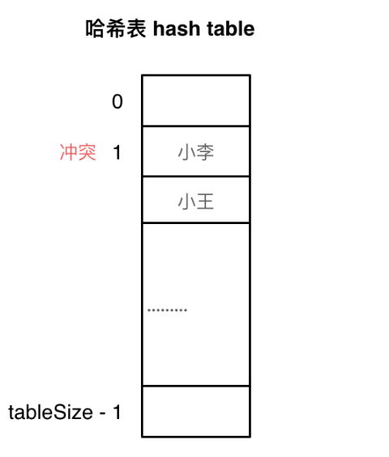

## 哈希表理论基础
> 哈希表（Hash table），又称散列表。哈希表中关键码就是数组的索引下标，然后通过下标直接访问数组中的元素。数组就是一张哈希表

- 作用：一般哈希表都是用来快速判断一个元素是否出现集合里

### 哈希函数
- 把学生的姓名直接映射到哈希表的索引上, 然后通过查询索引下标快速查找同学是否在该学校内。

> 哈希函数：通过hashCode把名字转化为数值，一般hashCode是通过特定编码方式，可以将其他数据格式转化为不同的数值，这样就把学生名字映射为哈希表上的索引数字了

hashCode得到数值大于哈希表大小（大于tableSize）为了保证映射出来的索引数值都落在哈希表上，我们会在再次对数值做一个取模的操作，这样我们就保证了学生姓名一定可以映射到哈希表上。这时候问题就在于：学生的数量大于哈希表的大小，怎么办

接下来哈希碰撞登场

### 哈希碰撞
> 哈希碰撞: 当两个数据映射在同一个索引下标，元素之间发生冲突，称为哈希碰撞

两种解决方法：1.拉链法 和 2. 线性探测法

#### 拉链法

拉链法就是要选择适当的哈希表的大小，这样既不会因为数组空值而浪费大量内存，也不会因为链表太长而在查找上浪费太多时间

#### 线性探测法
使用线性探测法，一定要保证tableSize大于dataSize。 我们需要依靠哈希表中的空位来解决碰撞问题.

例如冲突的位置，放了小李，那么就向下找一个空位放置小王的信息。所以要求tableSize一定要大于dataSize ，要不然哈希表上就没有空置的位置来存放 冲突的数据了。如图所示：

---
### 常见的三种哈希结构
- 1. 数组
- 2. set集合
- 3. map映射

### 总结
当我们遇到了要快速判断一个元素是否出现集合里的时候，就要考虑哈希法。哈希法也是牺牲了空间换取了时间