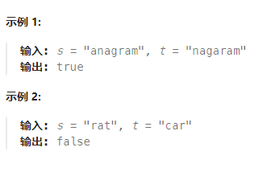

## 有效的字母异位词

### 力扣练习题[(戳一戳 ->)](https://leetcode.cn/problems/valid-anagram/description/)

> 给定两个字符串 s 和 t ，编写一个函数来判断 t 是否是 s 的字母异位词。

###### -示例


### 思路1： 排序
```jsx
/**
 * @param {string} s
 * @param {string} t
 * @return {boolean}
 */
var isAnagram = function(s, t) {
    return s.length === t.length && [...s].sort().join('') === [...t].sort().join('')
};

```

### 思路2：哈希表
```jsx
/**
 * @param {string} s
 * @param {string} t
 * @return {boolean}
 */
var isAnagram = function (s, t) {
    if (s.length !== t.length) return fasle
    const table = new Array(26).fill(0) //代表26个字母
    const base = 'a'.charCodeAt()
    for (const i of s) {
        table[i.charCodeAt() - base]++
    }
    for (const i of t) {
        if (!(table[i.charCodeAt() - base])) return false
        table[i.charCodeAt() - base]--
    }
    return true
};
```
