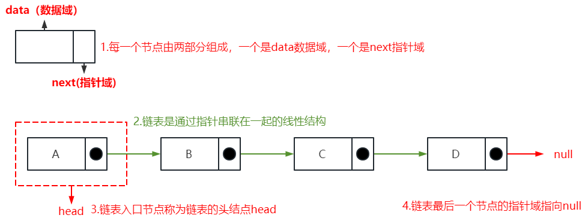
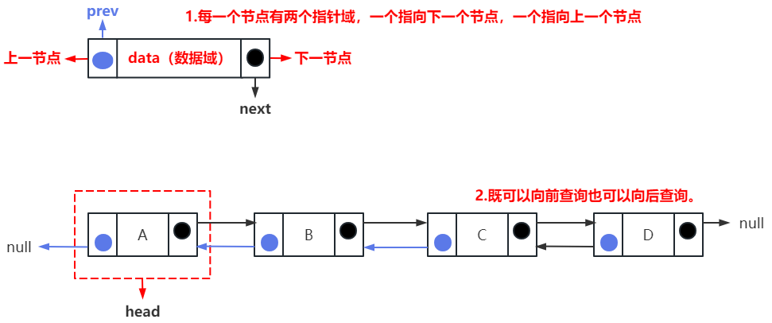
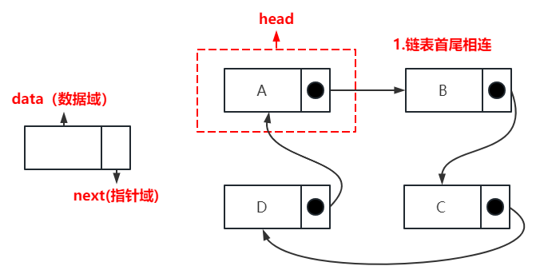
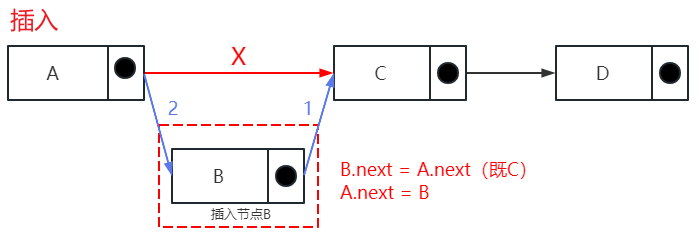
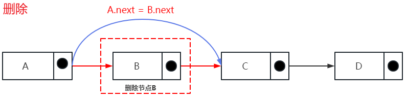

## 链表基础知识
> 链表是一种通过指针串联在一起的线性结构，每一个节点由两部分组成，一个是数据域一个是指针域（存放指向下一个节点的指针），最后一个节点的指针域指向null（空指针的意思）



### 特征
- 1.每一个节点由两部分组成，一个是data数据域，一个是next指针域
- 2.链表是通过指针串联在一起的线性结构
- 3.链表入口节点称为链表的头结点head
- 4.链表最后一个节点的指针域指向null
  
---
  
### 链表的类型
#### 单链表
- 任何链表都是建于单链表的基础上，上述描述的就是单链表结构

#### 双链表

##### 特征
> 单链表中的指针域只能指向节点的下一个节点。而 **双链表：**
> - **1.每一个节点有两个指针域，前面的指向上一个节点，后面的指向下一个节点** 
> - **2.既可以向前查询也可以向后查询**



#### 循环链表
> **循环链表**
> - **1.链表首尾相连** 
> - **2.可以用来解决约瑟夫环问题**



---

### 链表的存储方式
> - 我们都知道数组是在内存中是连续分布的
> - 但**链表在内存中并不是连续分布的**
> - 链表是通过**指针域的指针**链接在内存中各个节点

> 所以链表中的节点在内存中不是连续分布的 ，而是散乱分布在内存中的某地址上，分配机制取决于操作系统的内存管理


---
### 链表的定义（预先定义单链表为示例）
- 单链表

```js
// 定义单链表
class ListNode {
  constructor(data) {
    this.data = data; // 节点上存储的元素
    this.next = null; // 指向下一个节点的指针
  }
}
```
### 链表的操作
- 单链表操作具有 查找、删除、插入

```js
// 定义单链表操作
class ListOptions {
  constructor(){
    this.head = new ListNode('head') // 创建ListNode实例
  }
  // 查找
  find(){}
  // 插入
  insert(){}
  // 删除
  remove(){}
}
```
##### 查找
> 从头head开始查找，如果没有找到就把当前指针往后移，找到就返回该元素，最后都无法找到返回null

- 代码实现
```js
find(item){
    let currentNode = this.head // step1:从头head开始查找
    while(currentNode !== null && currentNode.data !== item){
        // 没有找到就把当前指针往后移
        currentNode = currentNode.next;
    }
    return currentNode // 找到就返回该元素,没找到就是null
}
```

##### 插入 （A,B之间插入C）
> - step1: 先创建一个新的节点（C）
> - step2：A,B之间插入C,找到需要哪个节点（A）后面进行插入，既节点（B）前面插入
> - step3：将A节点的next指向C节点，C节点指向下一个节点元素（既原来的B节点）



- 代码实现
```js
// item:要插入的数据
// data：数据插入到这个节点后面
insert(data,item){
    const newNode = new NodeList(item) // step1:先创建一个新的节点（C）
    // step2: 找到需要插入的位置
    const preCur = this.find(data)
    // step3: 改变next的顺序
    newNode.next = preCur.next // 新的元素先指向原本排A后面的节点（既B节点）
    preCur.next = newNode // A节点指向B节点的Next解除，A节点重新指向新节点C
}
```

##### 删除 （A,C之间删除B）
> - step1: 找到对应的节点A，A的下一个节点B需要删除
> - step2：节点A的next原本指向需要删除的节点B，重新指向到B的下一个节点C
> - step3：将A节点的next指向C节点，C节点指向下一个节点元素（既原来的B节点）



- 代码实现
```js
// 查上一个节点元素
findPre(item) {
    let cur = this.head
    while (cur.next !== null && cur.next.data !== item) {
        cur = cur.next
    }
    return cur
}

// item:要删除的节点数据
insert(item){
    const perCur = this.findPre(item) // step1:找到对应的节点A
    // step2: 改变next指向
    if(perCur.next !== null){
        perCur.next = item.next
    }
}
```
### 单链表完整实现

```js
// 单项链表

// 定义单链表
class ListNode {
  constructor(data) {
    this.data = data; // 节点上存储的元素
    this.next = null; // 指向下一个节点的指针
  }
}

class ListOptions {
    constructor(){
      this.head = new ListNode('head')
    }
    // ----------------------------查找
    find(item){
        let currentNode = this.head 
        while(currentNode !== null && currentNode.data !== item){
            currentNode = currentNode.next;
        }
        return currentNode
    }
    // ----------------------------插入
    insert(data,item){
        const newNode = new NodeList(item) 
        const preCur = this.find(data)
        newNode.next = preCur.next 
        preCur.next = newNode
    }

    // 查上一个节点元素
    findPre(item) {
        let cur = this.head
        while (cur.next !== null && cur.next.data !== item) {
            cur = cur.next
        }
        return cur
    }

    // -----------------------------删除
    insert(item){
        const perCur = this.findPre(item)
        if(perCur.next !== null){
            perCur.next = item.next
        }
    }

}
``` 
---

- 双链表
```js
 // 定义双链表
class  ListNode(val) {
    constructor(el) {
        this.val = val // 节点上存储的元素
        this.next = null // 指向下一个节点的指针
        this.pre = null // 指向上一个节点的指针
    }
}

class ListOptions {
    constructor(){
      this.head = new ListNode('head')
    }
    // ----------------------------查找
    find(item){
        let currentNode = this.head 
        while(currentNode !== null && currentNode.data !== item){
            currentNode = currentNode.next;
        }
        return currentNode
    }
    // ----------------------------插入
    insert(data,item){
        const newNode = new NodeList(item) 
        const preCur = this.find(data)
        newNode.next = preCur.next 
        preCur.next = newNode
        // 这时候next指向已经完善
        newNode.pre = preCur 
        newNode.next.per = newNode
    }

    // -----------------------------删除
    insert(item){
        const node = this.find(item)
        node.prev.next = node.next
        node.next.prev = node.prev
        node.next = null
        node.prev = null
    }

}
```

- 循环链表
```js
 // 定义循环链表
class  ListNode(val) {
    constructor(el) {
        this.val = val // 节点上存储的元素
        this.next = null // 指向下一个节点的指针
    }
}
// 循环链表只是需要考虑最后一个 next 指向header就ok
```

---
## 性能分析
|  | 查询 | 插入 | 删除 | 场景 |
| --- | --- | --- | --- | --- |
| 数组 | O(1) | O(n) | O(n) | 数据量固定，频繁查询，较少增删 |
| 链表 | O(n) | O(1) | O(1) | 数据量不固定，频繁增删，较少查询 |

- 数组在定义的时候，长度就是固定的，如果想改动数组的长度，就需要重新定义一个新的数组。
- 链表的长度可以是不固定的，并且可以动态增删， 适合数据量不固定，频繁增删，较少查询的场景。