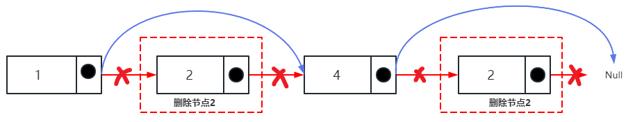
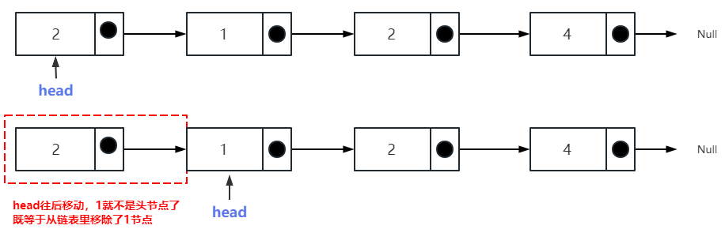
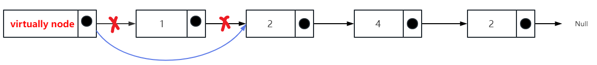

## 移除链表元素

### 力扣练习题[(戳一戳 ->)](https://leetcode.cn/problems/remove-linked-list-elements/)

> 给你一个链表的头节点 head 和一个整数 val ，请你删除链表中所有满足 Node.val == val 的节点，并返回 新的头节点 。

###### -示例1
```
输入：head = [1,2,6,3,4,5,6], val = 6
输出：[1,2,3,4,5]
```
###### -示例2
```
输入：head = [], val = 1
输出：[]
```
###### -示例3
```
输入：head = [7,7,7,7], val = 7
输出：[]
```

---
示例

```
输入： head = [1，2，4，2], val = 2
输出： [1,4]
```
### 操作链表的两种方式
- 1.直接使用原来的链表来进行删除操作。
- 2.设置一个虚拟头结点在进行删除操作。

#### 1.直接使用原来的链表
```
输入： head = [2，1，2，4], val = 2
输出： [1,4]
```


- 当head就是该val值时，移动head就是移除该节点

#### 2.设置一个虚拟头结点
```
输入： head = [2，1，2，4], val = 2
输出： [1,4]
```


- 