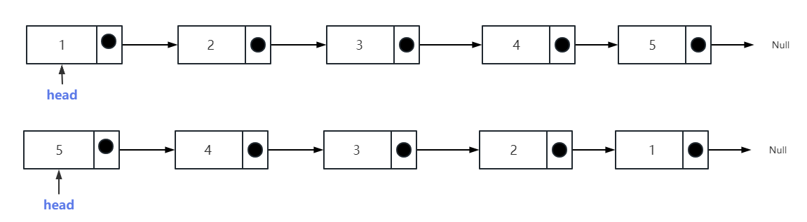
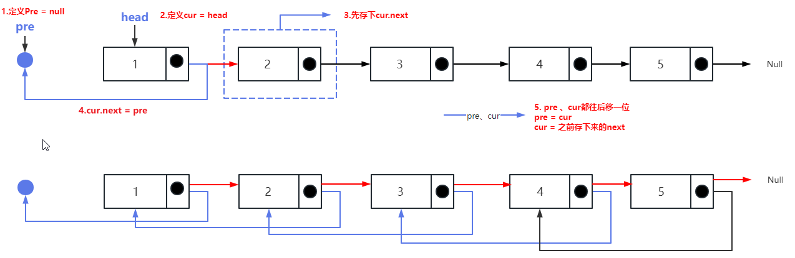
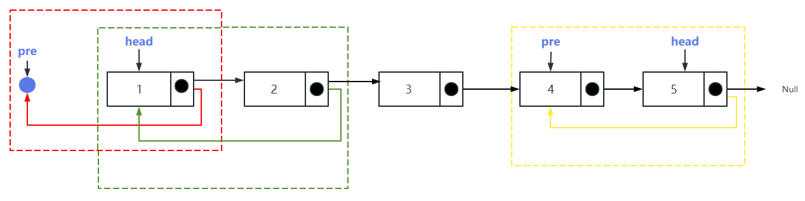

## 反转链表

### 力扣练习题[(戳一戳 ->)](https://leetcode.cn/problems/reverse-linked-list/)

> 给你单链表的头节点 head ，请你反转链表，并返回反转后的链表

###### -示例1

```
输入：head = [1,2,3,4,5]
输出：[5,4,3,2,1]
```

#### 思路1：双指针



> - step1: 定义pre = null、cur = head
> - step2：遍历链表，cur.next先存起来，cur.next -> pre
> - step3: pre、cur后移 pre = cur 、cur = cur.next

```js
 // 双指针
var reverseList = function(head) {
    if(!head || !head.next) return head;
    let pre = null 
    let cur = head 
    while(cur){
        const next = cur.next;
        cur.next = pre
        pre = cur
        cur = next 
    }
    return pre
};
```

#### 思路2：递归法1（从头到尾）


按上面得思路，使用递归法完成，不使用遍历
```js
 // 递归1
var reverse = function(pre,head){
    if(!head) return pre
    let next = head.next
    head.next = pre
    return reverse(head,next)
}
var reverseList = function(head) {
    if(!head || !head.next) return head
    return reverse(null, head)
};
```

#### 思路3：递归法2（从尾到头）

```js
 // 递归2
var reverse = function(pre,head){
   if(!head) return pre
   let newHead = reverse(head,head.next)
   head.next = pre
   return newHead
}
var reverseList = function(head) {
    if(!head || !head.next) return head
    return reverse(null,head)
};
```
