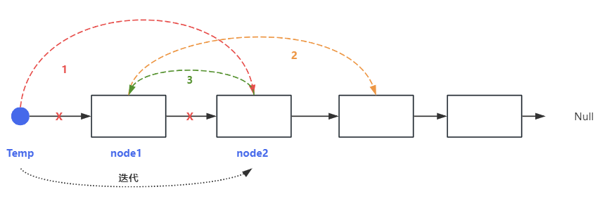

## 两两交换链表中的节点

### 力扣练习题[(戳一戳 ->)](https://leetcode.cn/problems/swap-nodes-in-pairs/description/)

> 给你一个链表，两两交换其中相邻的节点，并返回交换后链表的头节点。你必须在不修改节点内部的值的情况下完成本题（即，只能进行节点交换）

###### -示例


#### 思路1：迭代


> - 前提：定义temp、node1、node2
> - step1: 遍历链表,temp.next指向 node2
> - step2：node1 指向 node2.next
> - step3：node2.next 指向 node1
> - 这时node1和node2已经交换位置，下一次迭代交换 temp = node1 

```js
var swapPairs = function(head) {
    const dummyHead = new ListNode(0);
    dummyHead.next = head
    let temp = dummyHead
    while(temp.next && temp.next.next){
        const node1 = temp.next
        const node2 = temp.next.next
        temp.next = node2
        node1.next = node2.next
        node2.next = node1
        temp = node1
    }
    return dummyHead.next
};
```

#### 思路2：递归


> - step1: 两两一组，定义head 和 newHead，确定return出来什么
> - step2：head.next 会等于下一组的newHead（可递归）
> - step3: newHead => head

```js
var swapPairs = function(head) {
    if (head === null|| head.next === null) {
        return head;
    }
    const newHead = head.next;
    head.next = swapPairs(newHead.next);
    newHead.next = head;
    return newHead;
};
```