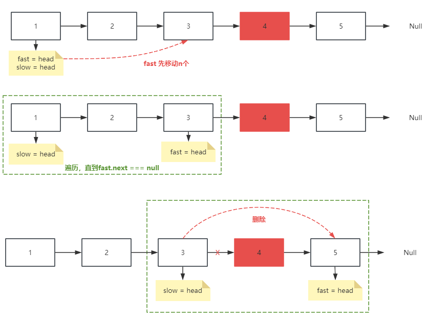

## 删除链表的倒数第N个节点

### 力扣练习题[(戳一戳 ->)](https://leetcode.cn/problems/remove-nth-node-from-end-of-list/description/)

>给你一个链表，删除链表的倒数第 n 个结点，并且返回链表的头结点


###### -示例


###### 思路1: 双指针


> - step1: 定义快慢两个指针- fast 、 slow
> - step2: fast先移动n个
> - step3: 遍历链表，使得fast即将指向Null，slow跟随移动
> - step4：删除操作

```jsx
var removeNthFromEnd = function (head, n) {
    let fast = head, slow = head
    for (let i = 0; i < n; i++) {
        fast = fast.next
    }
    if (!fast) return head.next
    while (fast.next != null) {
        fast = fast.next
        slow = slow.next
    }
    slow.next = slow.next.next //  slow.next.next === fast
    return head
};
```

- 如果是新增虚拟头节点
```jsx
var removeNthFromEnd = function (head, n) {
    let dummyHead = new ListNode(0, head)
    let fast = dummyHead, slow = dummyHead
    for (let i = 0; i < n+1; i++) {
        fast = fast.next
    }
    while (fast) {
        fast = fast.next
        slow = slow.next
    }
    slow.next = slow.next.next
    return dummyHead.next
};
```
---
