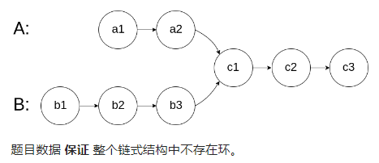
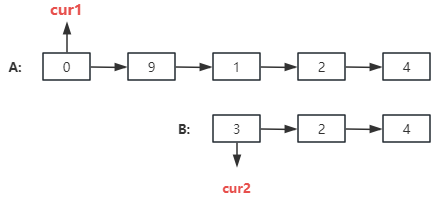
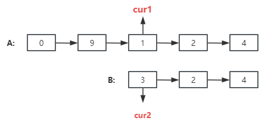

## 链表相交

### 力扣练习题[(戳一戳 ->)](https://leetcode.cn/problems/intersection-of-two-linked-lists-lcci/description/)

>给你两个单链表的头节点 headA 和 headB ，请你找出并返回两个单链表相交的起始节点。如果两个链表没有交点，返回 null 。

图示两个链表在节点 c1 开始相交：



###### -示例


> 注意：交点并不是数值相同，而是指针相同，就是求两个链表交点节点得指针。

###### 思路1: 双指针



> - step1: 定义两个指针- cur1 、 cur2
> - step2: 计算2个链表的长度
> - step3: 计算2个链表的差异，并把长的执行差异值那
> - step4：查找共同元素节点

```jsx
/**
 * @param {ListNode} headA
 * @param {ListNode} headB
 * @return {ListNode}
 */

const getLen = (head) => {
    let cur = head
    let len = 0
    while (cur) {
        len++ // 求A链
        cur = cur.next
    }
    return len
}
var getIntersectionNode = function (headA, headB) {
    const cur1Len =  getLen(headA) // 计算A链表的长度
    const cur2Len = getLen(headB)// 计算B链表的长度
    cur1 = headA;
    cur2 = headB;
    const maxlen = cur1Len > cur2Len ? cur1Len - cur2Len : cur2Len - cur1Len // 差异
    for (let i = 0; i < maxlen; i++) {
        if(cur1Len > cur2Len){
            cur1 = cur1.next
        }else{
            cur2 = cur2.next
        }
        // 把长链表移动到那个位置
    }
    while (cur1 && cur2 && cur1 !== cur2) {
        cur1 = cur1.next
        cur2 = cur2.next
    }
    return cur1
};
```


