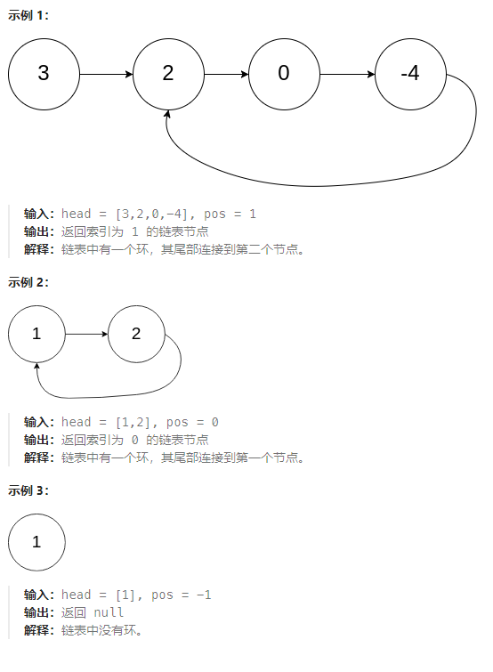

## 环形链表

### 力扣练习题[(戳一戳 ->)](https://leetcode.cn/problems/linked-list-cycle-ii/description/)

> 给定一个链表的头节点  head ，返回链表开始入环的第一个节点。 如果链表无环，则返回 null。

> 如果链表中有某个节点，可以通过连续跟踪 next 指针再次到达，则链表中存在环。 为了表示给定链表中的环，评测系统内部使用整数 pos 来表示链表尾连接到链表中的位置（索引从 0 开始）。如果 pos 是 -1，则在该链表中没有环。注意：pos 不作为参数进行传递，仅仅是为了标识链表的实际情况。

###### -示例



需要加入数学思维，
1. 如何判断链表是否是环，如果有环，如何找到这个环
2. 如果有环，如何找到这个环入口（相遇口）
###### 思路1 快慢指针
1. 如果是环，他们总会相遇。假如慢指针的速度是1节点/秒，快指针的速度是2节点/秒，只要是环，他们一定能相遇。fast指针一定先进入环中，如果fast指针和slow指针相遇的话，一定是在环中相遇。

2. 从头结点出发一个指针，从相遇节点 也出发一个指针，这两个指针每次只走一个节点， 那么当这两个指针相遇的时候就是 环形入口的节点


> - step1: 定义快慢指针
> - step2: 当快指针能走到null，证明无环，否则循环
> - step3: 循环，就一定有环会相遇，如果相遇就去找头节点
> - step4：一个从头，一个从相遇节点触发，一定会在入口再次相遇

```jsx
/**
 * @param {ListNode} head
 * @return {ListNode}
 */
var detectCycle = function(head) {
    let slow = head;fast=head
    while(fast && fast.next){
        fast = fast.next.next
        slow = slow.next
        if(fast === slow){
            // 相遇节点和头一起找
            let q = head
            while(q !== fast){
                q = q.next
                fast = fast.next
            }
            return fast
        }
    }
    return null;
};
```